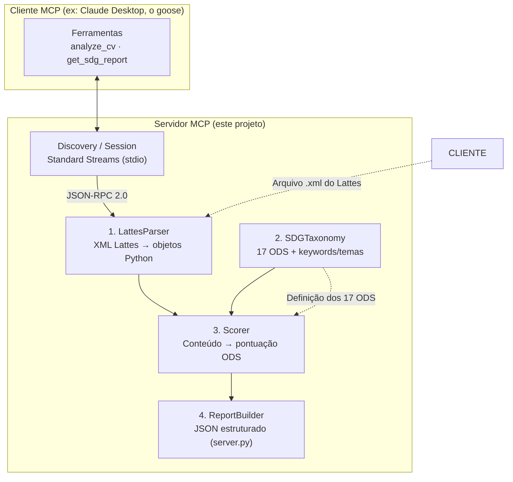

# Classificador de Currículo Lattes por ODS da ONU

Um **servidor MCP (Model Context Protocol)** que lê um Currículo Lattes (arquivo XML oficial),
analisa o conteúdo e classifica **o quanto esse currículo atende a cada um dos 17 ODS (Objetivos de
Desenvimento Sustentável) da ONU**.

---

## 1. A ideia, em uma frase

Você aponta um currículo Lattes para o sistema, e ele responde: *"seu currículo contribui bastante
para o ODS 4 (Educação de Qualidade) e para o ODS 13 (Ação Climática), moderadamente para o ODS 9
(Inovação), e praticamente não menciona ODS 14 (Vida na Água)."*

---

## 2. Por que isso existe

A ONU definiu 17 **Objetivos de Desenvimento Sustentável (ODS)** — um mapa global de prioridades para
resolver problemas do mundo até 2030. Pesquisadores e instituições precisam mostrar, de forma
comprensível, como o trabalho de uma pessoa se encaixa nesses objetivos. Esse servidor faz essa
"ponte" automaticamente.

---

## 3. Arquitetura do sistema

O sistema é dividido em **quatro camadas**, cada uma com uma única responsabilidade:



### As camadas

| # | Módulo | O que faz | Por que separar |
|---|--------|-----------|-----------------|
| 1 | `LattesParser` | Transforma o XML cru do Lattes em objetos Python organizados (formação, publicações, projetos…) | O XML do Lattes é enorme e bagunçado. Isolar isso evita que o resto do código dependa da estrutura XML |
| 2 | `SDGTaxonomy` | Define os 17 ODS, com nome, descrição e um conjunto de "pistas" (keywords + temas) para reconhecer cada um | Os ODS são o "dicionário" do sistema. Ter uma fonte única evita duplicação e facilita correção |
| 3 | `Scorer` | Pega o conteúdo estruturado e, usando as pistas, calcula uma pontuação 0–100 para cada ODS | É o "motor" de análise. Fica isolado para poder ser testado e ajustado sem tocar no resto |
| 4 | `ReportBuilder` | Monta a resposta final (JSON) com scores, rankings e justificativas | Separa a "lógica de negócio" da "forma de saída" |

---

## 4. Como funciona a classificação (o "motor")

O `Scorer` não "adivinha". Ele segue um processo explícito e transparente:

1. **Extração de pistas**: para cada trecho do currículo (títulos de disciplinas,
   nomes de cursos, títulos de artigos, áreas de pesquisa, projetos, extensão…), ele
   busca as **pistas** que a `SDGTaxonomy` conhece para cada ODS (ex.: "clima", "CO₂",
   "aquecimento global" → ODS 13).

2. **Pesagem por relevância**: nem todo trecho vale igual. Uma **publicação científica**
   sobre o tema vale mais que uma menção solta. O sistema pondera cada pista pelo peso da
   seção do Lattes.

3. **Consistência semântica**: se o mesmo tema aparece várias vezes, a contribuição para
   aquele ODS cresce (mas com retorno decrescente, para não inflar scores).

4. **Normalização**: a soma bruta é convertida em uma nota de **0 a 100** por ODS.

5. **Justificativa**: para cada ODS, o sistema mostra *quais* pistas encontradas e *de onde*
   vieram, para que o resultado seja explicável (não uma "caixa preta").

> O método é de **correspondência dirigida por conhecimento** (keywords + pesos), não de
> IA generativa. Isso torna o resultado determinístico, reproduzível e auditável — ideal para
> análise de currículo acadêmico.

---

## 5. Como usar

### 5.1 Rodar o servidor MCP

```bash
python -m lattes_sdg.server
```

Isso inicia o servidor MCP sobre o canal **stdio** (o padrão para clientes locais).

### 5.2 Conectar um cliente

Exemplo de configuração para um cliente MCP (`.json` de configuração):

```json
{
  "mcpServers": {
    "lattes-ods": {
      "command": "python",
      "args": ["-m", "lattes_sdg.server"]
    }
  }
}
```

### 5.3 Ferramentas expostas

O servidor oferece **duas ferramentas** para o cliente usar:

| Ferramenta | Argumento | O que retorna |
|------------|-----------|---------------|
| `analyze_cv` | `lattes_xml` (conteúdo do arquivo) ou `file_path` | Score de todos os 17 ODS, ranking e justificativas |
| `get_sdg_report` | mesmo `analyze_cv` | Relatório estruturado com scores, top ODS e detalhes por seção |

---

## 6. Estrutura do projeto

```
cv-ods-classifier/
├── README.md            # este arquivo
├── requirements.txt     # dependências (mcp já vem instalado)
├── lattes_sdg/
│   ├── __init__.py
│   ├── parser.py        # 1. LattesParser: XML Lattes → objetos Python
│   ├── sds.py           # 2. SDGTaxonomy: os 17 ODS + pistas
│   ├── scorer.py        # 3. Scorer: conteúdo → pontuação ODS
│   └── server.py        # 4. Servidor MCP + ReportBuilder
└── tests/
    └── test_classifier.py
```

---

## 7. Notas de design e extensibilidade

- **Adicionar um ODS novo** ou ajustar um existente: altere só o `sds.py` (lista de pistas).
  O resto do código não muda.
- **Ajustar pesos**: os pesos por seção vivem no `Scorer`. Ajuste `SECTION_WEIGHTS`.
- **Mudar a saída**: edite só o `ReportBuilder`. A lógica de pontuação não é tocada.
- **Testabilidade**: o `Scorer` e o `parser` são funções/puras, testáveis sem o servidor MCP.
```
