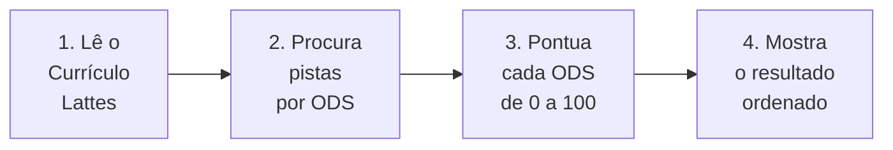

# 01 · A Ideia, Sem TI

> Você aponta um Currículo Lattes para o computador, e ele responde: *"seu trabalho
> contribui bastante para o ODS 13 (Ação Climática), moderadamente para ODS 4 (Educação)
> e ODS 9 (Inovação), e praticamente não fala de ODS 14 (Vida na Água)."*

Este documento explica o sistema **sem palavras técnicas**. Se você quiser os detalhes de
engenharia, vá para o documento [02 — Arquitetura](02-arquitetura.md).

---

## O problema que ele resolve

Imagine que você precisa responder a uma pergunta simples, mas chata:

> *"Meu trabalho (meu currículo) tem a ver com os grandes problemas do mundo?"*

A ONU, em 2015, montou um **lista de 17 grandes problemas mundiais** que ela quer ver
resolvidos até 2030. Cada um vale por um "ODS" (que você pode pensar como um **objetivo
mundial**). Veja só, é mais ou menos assim:

```
ODS 1  ·  Sem Pobreza
ODS 2  ·  Sem Fome
ODS 3  ·  Saúde e Bem-Estar
ODS 4  ·  Educação de Qualidade
ODS 5  ·  Igualdade de Gênero
ODS 6  ·  Água Potável e Saneamento
ODS 7  ·  Energia Sustentável
ODS 8  ·  Trabalho e Cresimento Econômico
ODS 9  ·  Inovação e Infraestrutura
ODS 10 ·  Redução de Desigualdades
ODS 11 ·  Cidades Sustentáveis
ODS 12 ·  Consumo e Produção Responsáveis
ODS 13 ·  Ação Climática
ODS 14 ·  Vida na Água
ODS 15 ·  Vida Terrestre
ODS 16 ·  Paz e Justiça
ODS 17 ·  Parcerias Mundiais
```

O problema é que **ninguém tem tempo de ler um currículo inteiro e pensar em cada um
desses 17 problemas**. O computador faz esse trabalho por você.

---

## O que o sistema faz, passo a passo

Pense nele como um **leitor muito cuidadoso** que faz três coisas:



1. **Lê o currículo.** O Lattes é um arquivo especial (um *XML*) que todo pesquisador
   brasileiro tem. Ele contém formação, publicações, projetos, linhas de pesquisa etc.
2. **Procura pistas.** Para cada ODS, o sistema "caça" palavras e temas que combinam com
   ele. Exemplo: se achar "aquecimento global", "CO₂", "metano" → isso é pista de ODS 13.
3. **Pontua de 0 a 100.** Cada ODS ganha uma nota. Não é "sim ou não" — é *"o quanto"*.
4. **Mostra ordenado.** Os ODS mais relevantes aparecem no topo; os que não foram
   citados aparecem lá embaixo.

---

## Uma analogia: o radar de temas

Pense no sistema como um **radar** que passa em cima do seu currículo e acende luzes.

- Luz **acesa forte** (nota alta) = seu trabalho fala muito daquele assunto.
- Luz **acesa fraca** (nota média) = aparece um pouco.
- Luz **apagada** (nota zero) = não apareceu nada.

E o melhor: o sistema mostra **onde** cada luz acesceu. Se ele deu nota alta ao ODS 13,
mostra: *"foi porque seu currículo fala de clima aqui, aqui e aqui."* Isso evita que a
conta chegue a ser um mistério — dá pra ver **por que** a nota é aquela.

---

## Por que isso é útil?

- **Para pesquisadores:** ver, de um relance, onde seu trabalho se encaixa no mundo.
- **Para comitês e avaliadores:** comparar vários currículos na mesma régua.
- **Para estudantes:** entender quais áreas do "mundo" seu campo de estudo toca.

---

## O que vem nos próximos documentos

| Documento | O que explica |
|-----------|---------------|
| [02 · Arquitetura](02-arquitetura.md) | Como as peças se encaixam (com desenho) |
| [03 · Modelo de dados](03-modelo-de-dados.md) | As "coisas" que o sistema guarda |
| [04 · Algoritmo](04-algoritmo.md) | Como a nota de 0 a 100 é calculada |
| [05 · Interface](05-interface.md) | Como um programa se conecta a ele |
| [06 · Runtime](06-runtime.md) | Como rodar e instalar |
| [07 · Requisitos não-funcionais](07-nf.md) | Qualidade, segurança, performance |
| [08 · Decisões](08-decisions.md) | Por que fizemos cada escolha |
| [09 · Glossário](09-glossario.md) | As palavras técnicas, explicadas |
