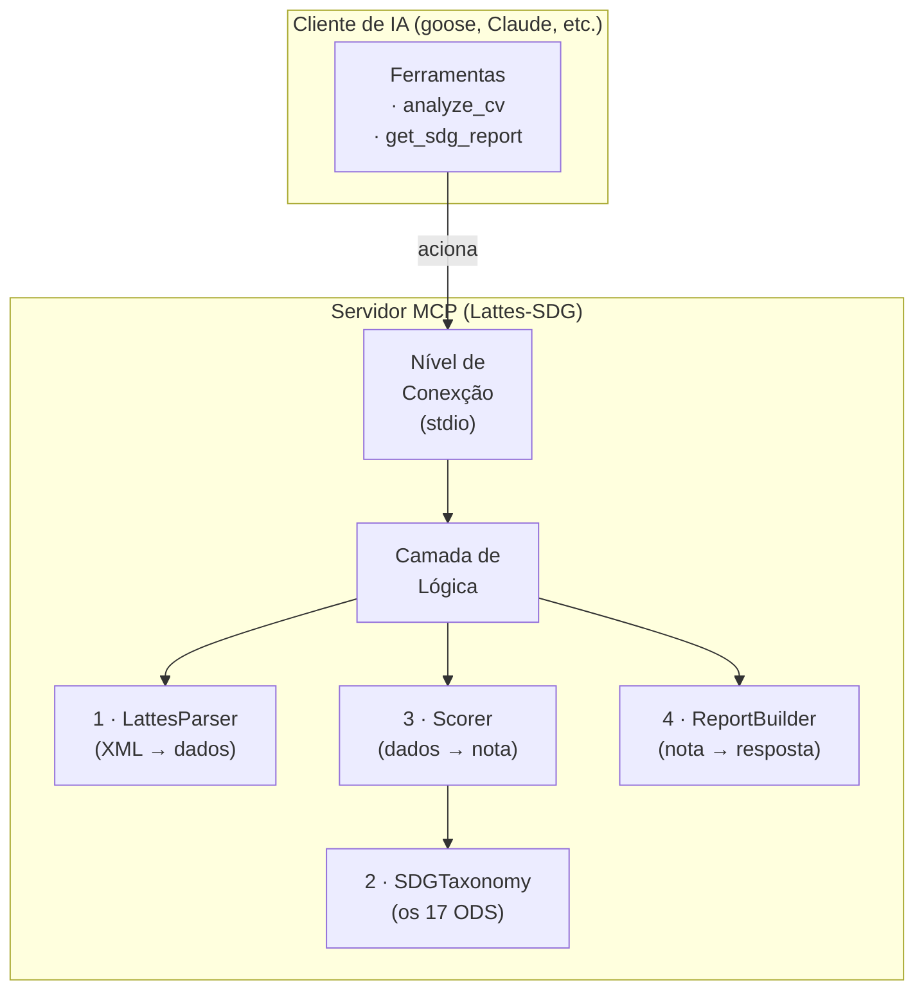
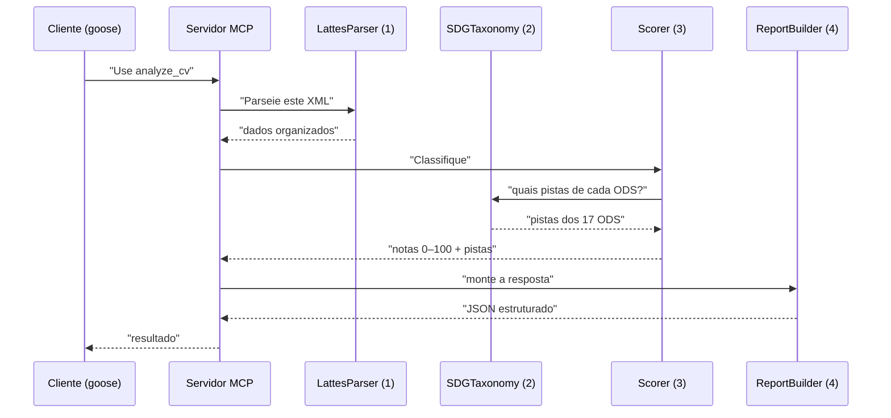
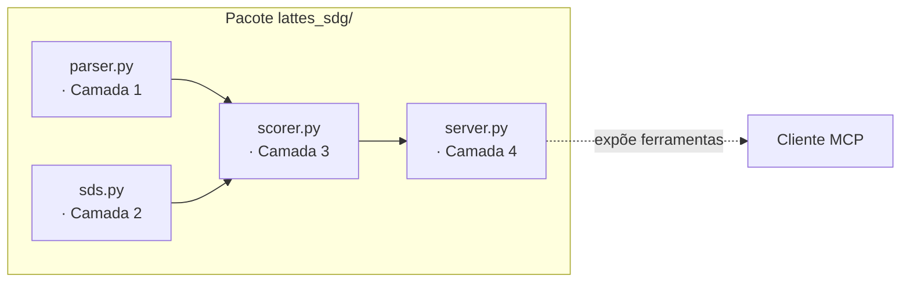

# 02 · Arquitetura

> A arquitetura responde a uma pergunta: *"como as peças do sistema se encaixam?"*

Este documento mostra o **mapa geral** do sistema Lattes‑SDG e como os componentes se
conectam. Se você quer entender o sistema por dentro, leia este documento; se quer saber
**como a nota é calculada**, vá para [04 — Algoritmo](04-algoritmo.md).

---

## 1. A visão de conjunto

O sistema é um **servidor MCP** (Model Context Protocol) que vive "dentro" de outro
programa (um cliente de IA, como o goose ou o Claude Desktop). Ele **não tem tela** — ele
recebe ordens por meio de **ferramentas** que esse outro programa lhe oferece.



> **Lembrete simples:** o servidor é o **trabalhador silencioso**. Ele só fala quando
> alguém (o cliente) pede para usar uma ferramenta. Nada é feito "no automático".

---

## 2. As quatro camadas

O sistema é dividido em **quatro camadas**, cada uma com **uma única tarefa**. Essa
divisão existe para que, se um dia precisar mudar uma peça, você não precise mexer nas
outras.

| # | Camada | Função | Por que separar |
|---|--------|--------|-----------------|
| 1 | **LattesParser** | Transforma o XML cru do Lattes em **dados organizados** | O XML do Lattes é gigante e bagunçado; isolar evita que o resto dependa dessa bagunça |
| 2 | **SDGTaxonomy** | Define os **17 ODS** e as pistas que reconhecem cada um | É a "fonte de verdade" sobre ODS — muda aqui, não nas outras camadas |
| 3 | **Scorer** | Pega os dados e **calcula a nota de 0 a 100** para cada ODS | É o "motor" — isolado para poder ser ajustado e testado sozinho |
| 4 | **ReportBuilder** | Monta a **resposta final** (JSON) | Separa o "resultado" do "formato em que ele é entregue" |

A ordem importa: os dados fluem da camada 1 → 2 → 3 → 4. Cada uma só **depende** da que
vem antes.



---

## 3. Onde cada camada vive no código



| Camada | Arquivo | O que faz |
|--------|---------|-----------|
| 1 · LattesParser | `lattes_sdg/parser.py` | Lê o XML, extrai campos categorizados (formação, publicações, projetos…) |
| 2 · SDGTaxonomy | `lattes_sdg/sds.py` | Lista os 17 ODS com nome, descrição e pistas |
| 3 · Scorer | `lattes_sdg/scorer.py` | Calcula a nota de cada ODS com base nas pistas |
| 4 · ReportBuilder | `lattes_sdg/server.py` | Expõe as ferramentas e devolve JSON |

> ⚠️ **Atenção:** o `server.py` faz **duas coisas ao mesmo tempo** — é a camada 4 *e* a
> "porta de entrada" do servidor. Isso é normal em servidores pequenos, mas o código é
> curto e bem dividido internamente.

---

## 4. Como o cliente se comunica (a parte "mágica")

O servidor fala com o cliente usando **JSON‑RPC**, um idioma simples de mensagens. As
duas ferramentas expostas são:

| Ferramenta | O que pede | O que devolve |
|------------|-----------|---------------|
| `analyze_cv` | "Analise este currículo" | Nota de todos os 17 ODS + ranking + top 5 |
| `get_sdg_report` | "Me dê o relatório completo" | Scores + ODS top + pistas de cada uma |

As ferramentas podem receber o currículo **de duas formas**:

```mermaid
flowchart TB
    C["Cliente"] -->|opção A| XML["XML colado<br/>(inline)"]
    C -->|opção B| F["Caminho do arquivo<br/>(.xml no disco)"]
    XML --> P["LattesParser"]
    F --> P
    P --> "camada 3 (Scorer)"
```

> Por que as duas formas? A **opção A** (colar o XML) é prática para demonstrações; a
> **opção B** (arquivo no disco) é a usada no dia a real, onde o Lattes já está salvo.

---

## 5. Resumo visual

O sistema é **uma linha de montagem**: entra XML bruto, sai uma nota explicada por ODS.
Nenhuma peça "acha" — tudo é **decisão guiada por regras** (palavras‑chave e pesos), não
por IA generativa. Isso significa: mesma entrada → mesma saída, sempre.

- **Camada 1** lê; **Camada 2** lembra dos ODS; **Camada 3** nota; **Camada 4** responde.
