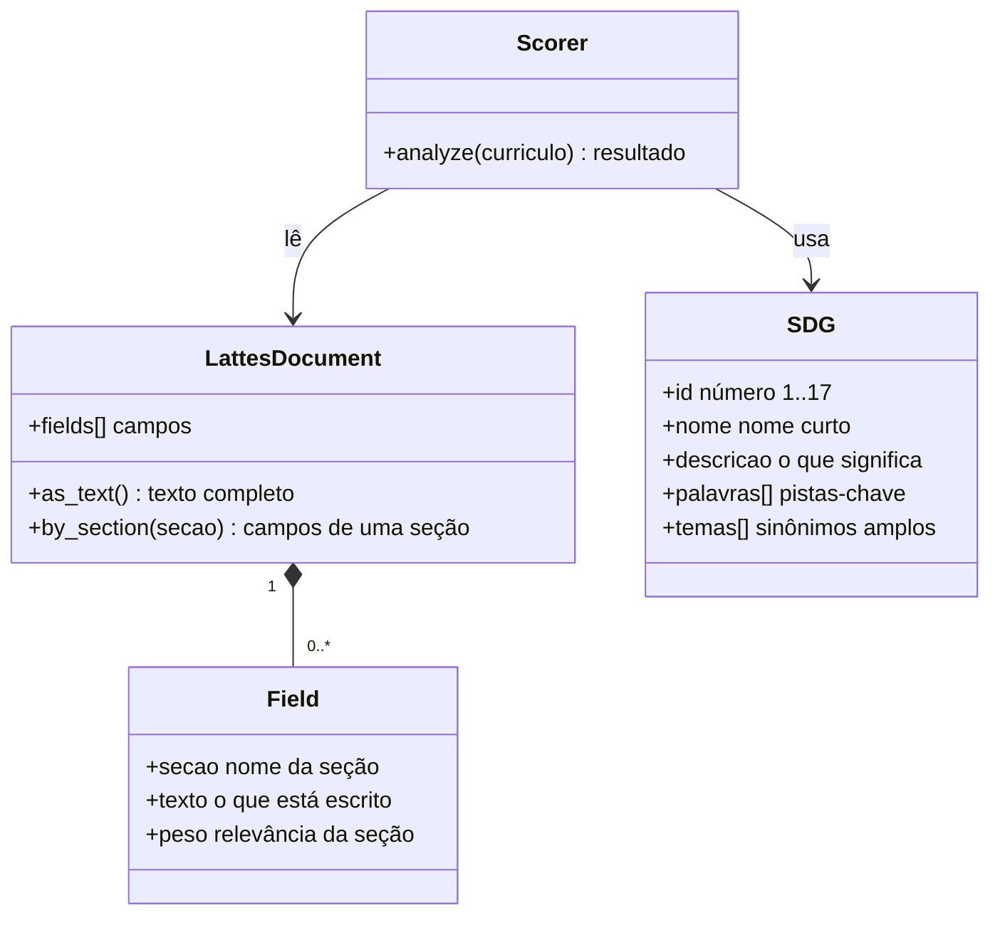
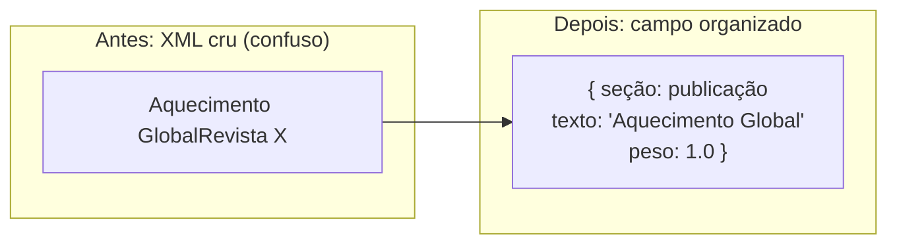
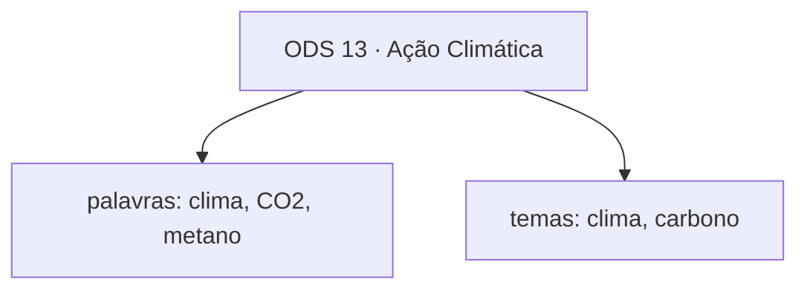
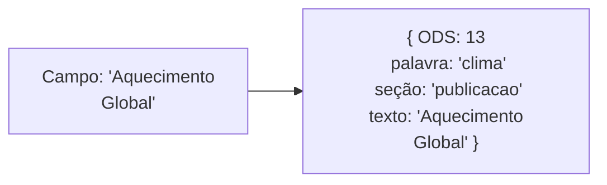
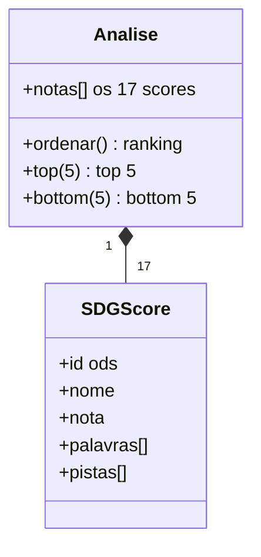

# 03 · Modelo de Dados

> Como o sistema "guarda" as coisas na cabeça dele.

Este documento apresenta as **peças de conhecimento** do sistema: o Currículo Lattes
convertido, o ODS, a pista, a nota. Se você quer saber o "como funciona o motor", leia
[04 — Algoritmo](04-algoritmo.md).

---

## 1. As três "coisas" do sistema

O sistema trabalha com **três kinds de objetos**. Pense neles como três tipos de papel
dentro do computador:

---

## 2. O Currículo Lattes (convertido)

O Lattes original é um **XML gigante** (muitas vezes centenas de linhas). O sistema não
trabalha com o XML diretamente — ele o **converte** em uma lista simples de campos.

Cada **campo** tem três informações:

| Campo | Significado | Exemplo |
|-------|-------------|---------|
| **seção** | *onde* o texto está no currículo | `publicacao`, `formacao`, `projeto` |
| **texto** | *o que* está escrito | *"Mudanças Climáticas e Ecossistemas"* |
| **peso** | *quanta relevância* essa seção tem | `1.0` para publicações; `0.3` para menções |

> **Por que converter?** O Scorer não precisa entender a "gramática" do XML. Ele só
> pergunta: *"existe algum campo da seção X cujo texto fala de clima?"* — e o parser já
> entregou os campos prontos.

### As seções mais importantes

Nem todo trecho do currículo vale o mesmo. O sistema dá pesos diferentes conforme a
seção:

| Seção | Peso | Por quê |
|-------|------|---------|
| Linha de pesquisa | 1.0 | É o núcleo da pesquisa do autor |
| Título de publicação | 1.0 | Publicação é evidência forte |
| Título de projeto | 0.8 | Projeto relevante |
| Resumo / descrição | 0.7 | Texto explicativo |
| Formação | 0.4 | Importante, mas menos direto |
| Menções genéricas | 0.3 | Pista fraca |

---

## 3. O ODS (o objetivo mundial)

Cada **ODS** é guardado com quatro informações:

| Atributo | Exemplo (ODS 13) |
|----------|------------------|
| **id** | `13` |
| **nome** | *"Ação Climática"* |
| **descricao** | *"Tomar urgência na luta contra a mudança do clima"* |
| **palavras** | `["clima", "CO2", "metano", "aquecimento global", ...]` |
| **temas** | `["clima", "mudanças climáticas", "carbono"]` |

Os **temas** são sinônimos mais amplos — usados quando nenhuma palavra‑chave bate, o
sistema faz uma "busca ampla" por esses termos.

> **Importante:** o SDGTaxonomy é a **única fonte** dos 17 ODS. Se um dia a ONU adicionar
> um 18º objetivo, a mudança acontece aqui — e só aqui.

---

## 4. A Pista (a evidência)

Quando o Scorer encontra uma palavra‑chave de um ODS num campo do currículo, ele cria uma
**pista** — um registro que diz *"isto é que prova essa nota"*.

As pistas são o que tornam o sistema **explicável**: a nota não é mágica, é feita de
pistas rastreáveis.

---

## 5. A Nota (o resultado)

Cada ODS recebe uma **nota** de 0 a 100, acompanhada de:

- **palavras encontradas**: quais pistas-chave batem
- **pistas**: a lista de evidências (limitada a 6 por ODS, para não poluir)

> ⚠️ **Detalhe importante:** a nota é **relativa à densidade de pistas**, não absoluta.
> Um ODS com 30 pistas não ganha 30× mais — existe uma **curva de saturação** (ver
> [04 — Algoritmo](04-algoritmo.md)) que evita inflar o resultado.

---

## 6. Resumo

O sistema move três kinds de objetos: **campos** (currículo convertido), **ODS** (os
objetivos) e **notas** (o resultado). Entre eles, as **pistas** ligam um ao outro e
respondem à pergunta *"por que essa nota?"*.
