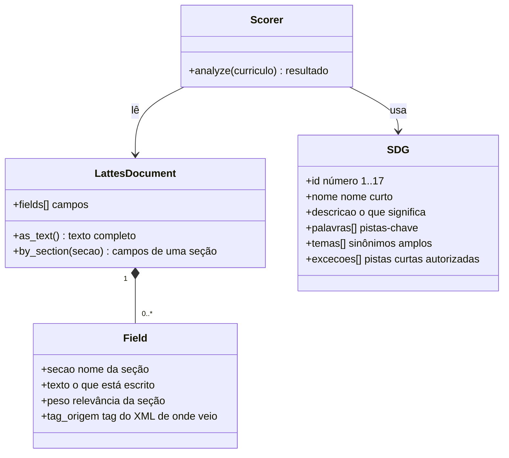
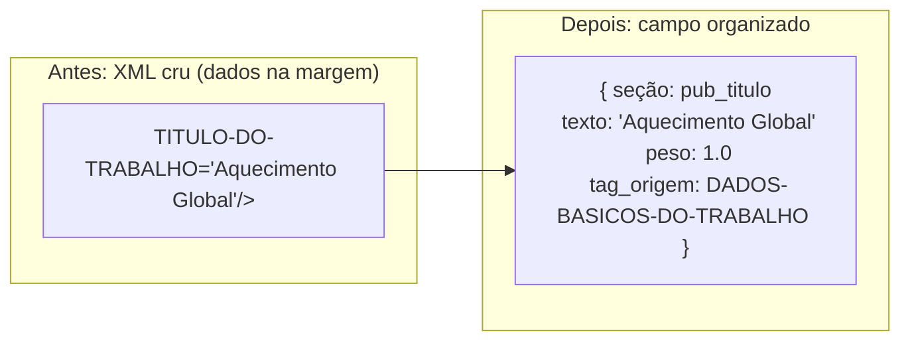
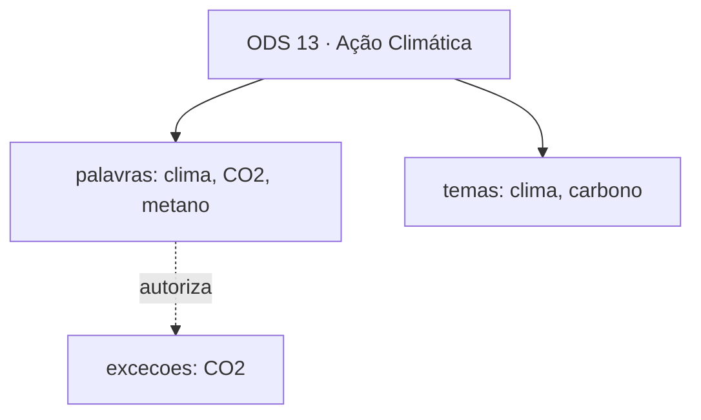
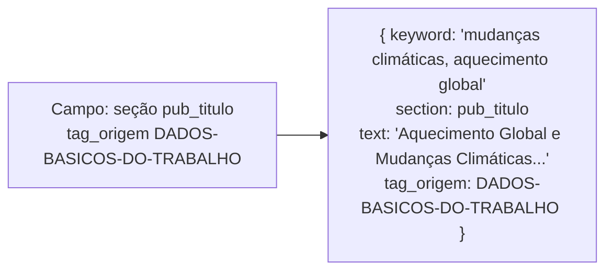
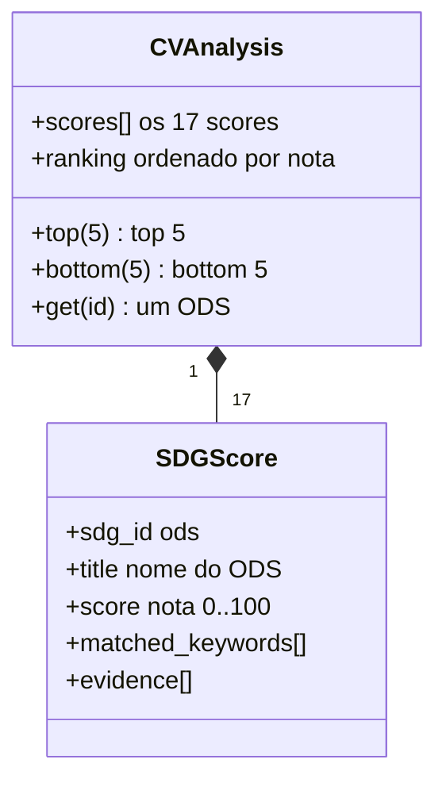

# 03 · Modelo de Dados

> Como o sistema "guarda" as coisas na cabeça dele.

Este documento apresenta as **peças de conhecimento** do sistema: o Currículo Lattes
convertido, o ODS, a pista, a nota. Se você quer saber o "como funciona o motor", leia
[04 — Algoritmo](04-algoritmo.md).

---

## 1. As três "coisas" do sistema

O sistema trabalha com **três kinds de objetos**. Pense neles como três tipos de papel
dentro do computador:

---

## 2. O Currículo Lattes (convertido)

O Lattes original é um **XML gigante** (muitas vezes centenas de linhas). O sistema não
trabalha com o XML diretamente — ele o **converte** em uma lista simples de campos.

Na exportação **oficial** do Lattes, o conteúdo não está no texto da tag: está nos
**atributos** de tags MAIÚSCULAS com hífen (`<RESUMO-CV TEXTO-RESUMO-CV-RH="..."/>`),
em geral em ISO-8859-1. O parser decodifica o arquivo, varre tags e atributos, aplica a
tabela de mapeamento (elemento → atributo → seção → peso) e **descarta os dados
pessoais no momento da extração** — CPF, e-mail, telefone, endereço, data de nascimento
e nomes (próprios e de terceiros) nunca viram campo.

Cada **campo** tem quatro informações:

| Campo | Significado | Exemplo |
|-------|-------------|---------|
| **seção** | *onde* o texto está no currículo | `pub_titulo`, `formacao_area`, `atuacao` |
| **texto** | *o que* está escrito | *"Mudanças Climáticas e Ecossistemas"* |
| **peso** | *quanta relevância* essa seção tem | `1.0` para títulos de publicação; `0.7` para palavra-chave |
| **tag_origem** | de *qual tag do XML* o valor veio | `RESUMO-CV`, `DADOS-BASICOS-DO-ARTIGO` |

> **Por que converter?** O Scorer não precisa entender a "gramática" do XML. Ele só
> pergunta: *"existe algum campo da seção X cujo texto fala de clima?"* — e o parser já
> entregou os campos prontos, com a origem rastreável (`tag_origem`) até o XML.

### As seções e seus pesos (`SECTION_WEIGHTS`)

Nem todo trecho do currículo vale o mesmo. O sistema dá pesos diferentes conforme a
seção — uma publicação científica sobre um tema vale mais que uma menção solta. As
**24 entradas** abaixo são idênticas às chaves de `SECTION_WEIGHTS`
(`lattes_sdg/scorer.py`), em ordem decrescente de peso (empates na ordem em que o
código os declara):

| Chave (`SECTION_WEIGHTS`) | Peso |
|---------------------------|------|
| `linhaPesquisa` | 1.0 |
| `pub_titulo` | 1.0 |
| `pub_trabalho` | 1.0 |
| `pub_obra` | 1.0 |
| `projeto_descricao` | 0.9 |
| `projeto_titulo` | 0.8 |
| `resumo` | 0.8 |
| `atuacao` | 0.7 |
| `palavra_chave` | 0.7 |
| `descricao_curriculo` | 0.7 |
| `objetivo` | 0.6 |
| `sinopse` | 0.6 |
| `pub_evento` | 0.5 |
| `formacao_area` | 0.5 |
| `formacao_nivel` | 0.5 |
| `descricao` | 0.5 |
| `formacao_assunto` | 0.4 |
| `pub_tipo` | 0.4 |
| `formacao_titulo` | 0.4 |
| `titulo` | 0.3 |
| `pub_revista` | 0.3 |
| `pub_periodico` | 0.3 |
| `formacao_instituicao` | 0.2 |
| `formacao_ano` | 0.1 |

> **O código é a fonte da verdade.** Esta tabela é uma fotografia de `SECTION_WEIGHTS`
> em `lattes_sdg/scorer.py`; se um dia os dois divergirem, vale o código. A seção fora
> do mapa cai no padrão `0.3` (`SECTION_WEIGHTS.get(secao, 0.3)` em `analyze`).

### Parâmetros do cálculo (constantes do scorer)

Além dos pesos, três constantes de `lattes_sdg/scorer.py` governam o resultado:

| Constante | Valor | O que controla |
|-----------|-------|----------------|
| `SATURATION_K` | `1.4` | constante da curva de saturação (`_normalize`) — quanto maior, mais pistas para chegar perto de 100 |
| `DECAY` | `0.55` | fator de decaimento por repetição: a iª ocorrência vale `DECAY ** i` da primeira (`_raw_score`) |
| `MAX_EVIDENCE_PER_SDG` | `6` | máximo de evidências listadas por ODS (`analyze`); a soma bruta conta todas, só a explicação encurta |

> De novo: **o código é a fonte da verdade** — confira os três valores em
> `lattes_sdg/scorer.py`. O exemplo numérico reproduzível está em
> [04 — Algoritmo](04-algoritmo.md).

### As seções que o formato oficial abriu

A leitura de atributos tornou visíveis seções que antes não apareciam (as duas primeiras
são **novas** nesta onda):

| Seção | Vem de | Conteúdo |
|-------|--------|----------|
| `atuacao` | `OUTRA-ATIVIDADE-TECNICO-CIENTIFICA`, `DIRECAO-E-ADMINISTRACAO`, `CONSELHO-COMISSAO-E-CONSULTORIA` | atividades técnico-científicas, cargos e conselhos |
| `palavra_chave` | `PALAVRAS-CHAVE` (`PALAVRA-CHAVE-1..6`) | as próprias palavras-chave do autor |
| `resumo`, `objetivo` | `RESUMO-CV`, `LINHA-DE-PESQUISA` | texto corrido do currículo e da linha de pesquisa |
| `linhaPesquisa` | `LINHA-DE-PESQUISA` | títulos de linha de pesquisa |
| `pub_titulo`, `pub_obra`, `pub_evento` | `ARTIGO-PUBLICADO`, `LIVRO-PUBLICADO-OU-ORGANIZADO`, `TRABALHO-EM-EVENTOS`, `PARTICIPACAO-EM-CONGRESSO` | títulos de artigo/livro e nomes de evento |
| `projeto_titulo`, `projeto_descricao` | `PROJETO-DE-PESQUISA` | nome e descrição de projeto |
| `formacao_area`, `formacao_titulo`, `formacao_instituicao` | `AREA-DE-ATUACAO`, `GRADUACAO`/`MESTRADO`/`DOUTORADO` | área do conhecimento, título de conclusão e instituição |

> **O que nunca vira seção:** dados pessoais. CPF, e-mail, telefone, endereço, data de
> nascimento e nomes (próprios ou de coautores) são descartados **antes** de qualquer
> mapeamento — a nota não pode ser movida pelo nome de ninguém (requisito 5 do
> [07 — Não Funcionais](07-nf.md)).

---

## 3. O ODS (o objetivo mundial)

Cada **ODS** é guardado com estes atributos:

| Atributo | Exemplo (ODS 13) |
|----------|------------------|
| **id** | `13` |
| **nome** | *"Ação Climática"* |
| **descricao** | *"Tomar urgência na luta contra a mudança do clima"* |
| **palavras** | `["clima", "CO2", "metano", "aquecimento global", ...]` |
| **temas** | `["clima", "mudanças climáticas", "carbono"]` |
| **excecoes** | `["CO2"]` — pistas curtas autorizadas a pontuar |

Os **temas** são sinônimos mais amplos: entram na varredura principal como pistas
amplas e, quando o currículo inteiro não casou com nenhuma palavra‑chave, alimentam a
**"busca ampla"** de fallback (uma vez por ODS — ver
[04 — Algoritmo](04-algoritmo.md)).

### Como as pistas ficam prontas para a busca

Palavras e temas não são comparados "cruos": cada pista é **pré-processada uma única
vez**, na construção da taxonomia, e só a forma preparada entra na comparação:

| Passo | O que faz |
|-------|-----------|
| **Normalização** | minúsculas + remoção de acentos + colapso de espaços (`climática` = `climatica`) |
| **Fronteira de palavra** | a pista só casa como palavra inteira ou expressão — nunca como pedaço de outra |
| **Ban-list** | pista com menos de 4 letras não pontua, **salvo** se estiver em `excecoes` (ex.: `CO2`) |
| **Dedupe** | normalizados repetidos caem fora; a primeira declaração vence |

> É esse funil único que mata os falsos positivos por substring: a pista `ia` não casa em
> "Ciências" e a pista `mar` não casa em "Maria" — nem `mar` casa em "marinho" como
> pedaço, porque a comparação exige fronteira.

> **Importante:** o SDGTaxonomy é a **única fonte** dos 17 ODS. Se um dia a ONU adicionar
> um 18º objetivo, a mudança acontece aqui — e só aqui.

---

## 4. A Pista (a evidência)

Quando o Scorer encontra uma palavra‑chave de um ODS num campo do currículo, ele cria uma
**pista** (evidência) — um registro que diz *"isto é que prova essa nota"*. Cada evidência
aponta para **um único campo** e carrega quatro chaves:

| Chave | Conteúdo |
|-------|----------|
| `keyword` | as palavras que casaram nesse campo (agrupadas, sem repetir) |
| `section` | a seção do campo que pontuou |
| `text` | o trecho citado (o texto do campo, truncado em 120 caracteres) |
| `tag_origem` | a tag do XML de onde o campo veio — a ponta da rastreabilidade |

No exemplo prático do [04 — Algoritmo](04-algoritmo.md), o `Scorer.analyze` devolve
**três** evidências para o ODS 13 — uma por campo, na ordem dos campos do currículo:

| `keyword` | `section` | `text` | `tag_origem` |
|-----------|-----------|--------|--------------|
| `mudanças climáticas` | `linhaPesquisa` | `Mudanças Climáticas e Ecossistemas` | `LINHA-DE-PESQUISA` |
| `aquecimento global` | `pub_titulo` | `Aquecimento Global e Biodiversidade Florestal` | `DADOS-BASICOS-DO-ARTIGO` |
| `mudanças climáticas` | `palavra_chave` | `mudanças climáticas` | `PALAVRA-CHAVE-1` |

> O comando que reproduz essas três linhas (e a nota `71.6`) está em
> [04 — Algoritmo](04-algoritmo.md) — **o código é a fonte da verdade**.

Três regras de quantidade, para a lista explicar sem poluir:

- **1 evidência por campo por ODS** — se três palavras do mesmo ODS caem no mesmo campo,
  elas são agrupadas numa única evidência; campos distintos geram evidências distintas.
- **no máximo 6 evidências por ODS** — além disso, o excesso é cortado.
- **fallback: no máximo 1 evidência por ODS** — a busca ampla por temas (seção
  `busca_ampla`) só roda quando a varredura principal não achou nada no currículo
  inteiro, e emite uma evidência só.

As pistas são o que tornam o sistema **explicável**: a nota não é mágica, é feita de
pistas rastreáveis até a tag de origem no XML.

---

## 5. A Nota (o resultado)

Cada ODS recebe uma **nota** de 0 a 100, acompanhada de:

- **palavras encontradas** (`matched_keywords`): quais pistas‑chave batem
- **evidências** (`evidence`): a lista de pistas (limitada a 6 por ODS, para não poluir)

> **Detalhe importante:** a nota é **relativa à densidade de pistas**, não absoluta.
> Um ODS com 30 pistas não ganha 30× mais — existe uma **curva de saturação** (ver
> [04 — Algoritmo](04-algoritmo.md)) que evita inflar o resultado.

> **Determinismo:** a mesma entrada devolve sempre a mesma saída, byte a byte. Listas
> preservam ordem de inserção (nada de iteração de `set` no caminho da serialização),
> então duas execuções seguidas produzem o mesmo JSON.

---

## 6. Resumo

O sistema move três kinds de objetos: **campos** (currículo convertido, cada um com
seção, texto, peso e `tag_origem`), **ODS** (os objetivos, com pistas já normalizadas e
com fronteira de palavra) e **notas** (o resultado). Entre eles, as **pistas** ligam um
ao outro e respondem à pergunta *"por que essa nota?"* — no máximo uma por campo por ODS,
com o trecho citado e a tag de origem. Dados pessoais ficam de fora: nunca viram campo.
