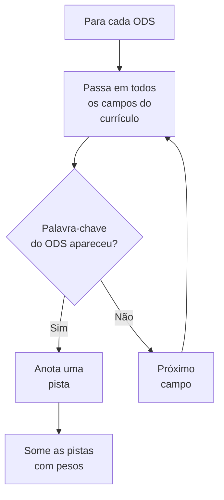
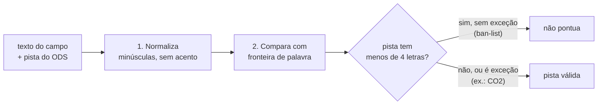
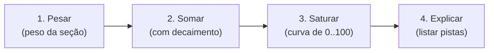
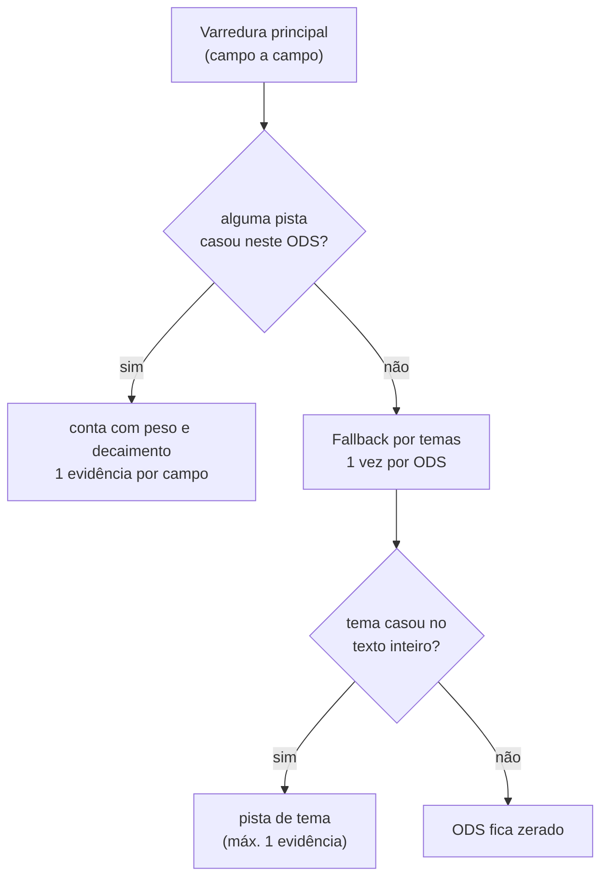
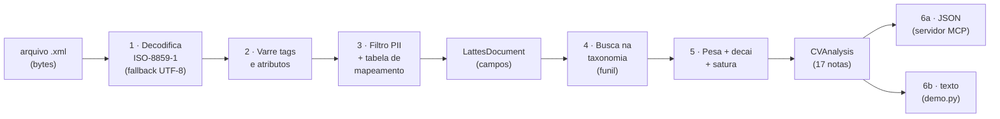

# 04 · O Algoritmo de Classificação

> Como o sistema chega na nota de 0 a 100 para cada ODS — sem magia, sem IA adivinhando.

Este é o coração do sistema. Ele responde à pergunta: *"por que o ODS 13 tem 75 e não 90?"*

Se você quer entender o **que** o sistema guarda, leia [03 — Modelo de Dados](03-modelo-de-dados.md).
Aqui vamos ao **como** ele pontua.

---

## 1. A ideia central: "caçar pistas"

O algoritmo funciona como um detetive que passa uma lista de ODS na mão de cada
documento, procurando **pistas**. Uma pista é quando **uma palavra de um ODS aparece num
campo do currículo**.



> **Analogia:** é como passar um ímã em cima de um monte de areia. As pistas são os
> preguinhos que o ímã (o ODS) consegue puxar. Quanto mais preguinhos, maior a nota.

### O funil: quando duas strings são a mesma palavra

Antes de comparar, texto e pista passam pelo **mesmo funil** — é ele que decide o que
conta como palavra:



1. **Normalização única** — minúsculas, sem acento, espaços colapsados, aplicada dos
   dois lados: `climática` e `climatica` viram a mesma coisa.
2. **Fronteira de palavra** — a pista só casa cercada de limites de palavra: `ia` não
   casa em "Ciências" (o pedaço está no meio da palavra) e `mar` não casa em "Maria".
   Hífen conta como fronteira (`pesquisa-e-desenvolvimento` é dividido em palavras).
3. **Ban-list com exceções** — pista com menos de 4 letras não pontua por padrão; a
   taxonomia autoriza pontualmente (ex.: `CO2`).

> **Por que isso importa?** Antes, a comparação era por substring: a nota era movida por
> **nomes** ("Maria" pontuava o ODS 14 pela pista "mar"). Com o funil, só o conteúdo
> acadêmico pontua — e dados pessoais nem chegam ao algoritmo, porque o parser os
> descarta antes (ver [03 — Modelo de Dados](03-modelo-de-dados.md)).

---

## 2. Os quatro passos da nota

O cálculo da nota é feito em **quatro etapas**, sempre na mesma ordem:



### Passo 1 — Pesar
Cada pista ganha o **peso da seção** onde apareceu, lido de `SECTION_WEIGHTS` (as 24
chaves estão na [03 — Modelo de Dados](03-modelo-de-dados.md)). Uma publicação sobre
clima vale mais que uma menção solta:

| Onde a pista apareceu | Chave (`SECTION_WEIGHTS`) | Peso |
|-----------------------|---------------------------|------|
| Linha de pesquisa / título de publicação | `linhaPesquisa`, `pub_titulo`, `pub_trabalho`, `pub_obra` | 1.0 |
| Título de projeto / resumo | `projeto_titulo`, `resumo` | 0.8 |
| Palavra-chave / descrição do currículo | `palavra_chave`, `descricao_curriculo` | 0.7 |
| Objetivo / sinopse | `objetivo`, `sinopse` | 0.6 |
| Formação (assunto, título) / tipo de publicação | `formacao_assunto`, `formacao_titulo`, `pub_tipo` | 0.4 |
| Menção genérica (e seção fora do mapa) | `titulo`, `pub_revista`, `pub_periodico` | 0.3 |
| Ano de formação | `formacao_ano` | 0.1 |

> Subconjunto ilustrativo (todas as 24 chaves estão no
> [03 — Modelo de Dados](03-modelo-de-dados.md)); cada linha confere com
> `SECTION_WEIGHTS` em `lattes_sdg/scorer.py`. Chave fora do mapa entra com o padrão
> `0.3`.

### Passo 2 — Somar (com decaimento)
Se a mesma pista aparece várias vezes, a **1ª** conta 100%, a **2ª** conta 55% e a **3ª**
conta 30,25% etc. Isso evita que um ODS ganhe nota alta só porque a palavra se repetiu.

A progressão é **geométrica**: `_raw_score` soma cada ocorrência multiplicada por
`DECAY ** i` (com `i` começando em 0 e `DECAY = 0.55`). Logo, os primeiros
multiplicadores são **1** (`0.55⁰`), **0.55** (`0.55¹`) e **0.3025** (`0.55²`).

> **Procedência:** o laço `total += c * (DECAY ** i)` dentro de `Scorer._raw_score`, em
> `lattes_sdg/scorer.py`, com a constante `DECAY = 0.55` declarada na mesma fonte.

> **Por que isso importa?** Um currículo que repete "clima" 50 vezes não deveria
> automaticamente bater um que fala de clima 500 vezes. A soma "decai", ficando mais
> lenta a cada ocorrência — como um copo que enche rápido no começo e devagar no fim.

### Passo 3 — Saturar (a curva)
A soma bruta é convertida em nota de 0 a 100 por uma **curva exponencial**:

```
nota = 100 × (1 − e^(−soma ÷ K))
```

onde **K** é `SATURATION_K = 1.4` (`lattes_sdg/scorer.py`) — a constante que controla a
"velocidade" da curva: quanto maior, mais pistas para chegar perto de 100.

> **Os números exatos vivem no código:** decaimento (`DECAY = 0.55`), constante `K`
> (`SATURATION_K = 1.4`) e os 24 pesos de seção (`SECTION_WEIGHTS`) estão em
> `lattes_sdg/scorer.py` — **o código é a fonte da verdade**. Este documento espelha
> esses valores (reconciliados na Onda M1); a Onda M0 mudou a leitura e a busca, não o
> cálculo.

```mermaid
xyChart
    title "Soma bruta → Nota (0 a 100), com SATURATION_K = 1.4"
    xaxis "Soma bruta" [0, 1, 2, 3, 4, 5, 6]
    yaxis "Nota" [0, 25, 50, 75, 100]
    line [0, 51, 76, 88.3, 94.3, 97.2, 98.6]
```

> **Ler o gráfico:** valores obtidos executando `_normalize` (comando da seção 4) para
> cada soma bruta. Notas sobem rápido no começo e desaceleram no fim. Isso significa que
> **poucas pistas já dão uma nota razoável**, mas chegar perto de 100 exige **muitas
> pistas** — e não vale a pena repetir palavras infinitamente.

### Passo 4 — Explicar
O sistema lista as **pistas** que formaram a nota (limitado a 6 por ODS). Assim, a nota
nunca é um número misterioso — ela sempre tem **evidências** que a justificam.

A lista é deduplicada antes de sair:

| Regra | Efeito |
|-------|--------|
| **1 evidência por campo por ODS** | várias palavras do mesmo ODS no mesmo campo viram **uma** evidência agrupada (`keyword`), não três |
| **campos distintos → evidências distintas** | rastreabilidade preservada; nenhuma combinação campo/ODS aparece duas vezes |
| **máx. 6 evidências por ODS** | o resto é cortado — a nota continua contando tudo, só a explicação encurta |
| **fallback máx. 1 evidência por ODS** | a busca ampla entra como uma evidência só, na seção `busca_ampla` |

Cada evidência carrega `section`, `tag_origem` (a tag do XML de onde o campo veio) e
`text` (o trecho citado, truncado em 120 caracteres) — dá para voltar do resultado até a
origem no arquivo.

---

## 3. O que conta como "pista"

O ODS tem **duas rodadas** de busca — e a segunda só existe se a primeira falhar:

| Rodada | Como funciona | Quando |
|--------|---------------|--------|
| **Varredura principal** | para cada campo, procura palavras‑chave **e** temas com o funil (normalização + fronteira + ban‑list) | sempre |
| **Fallback por temas** | uma única passagem por **todo o texto** do currículo, por ODS | **só** se a varredura principal não achou nada; emite **no máximo 1 evidência** |



> **Por que duas rodadas?** As palavras‑chave são precisas; os temas são amplos e podem
> se partir entre campos (uma expressão começa em um campo e termina em outro). O fallback
> cobre esse caso **uma vez só** — sem inflar a lista de evidências nem rodar por campo.

> **Só conteúdo pontua:** a busca vê o texto dos campos; CPF, e‑mail, telefone e nomes
> nunca chegam aqui, porque o parser os descarta antes (requisito 5 do
> [07 — Não Funcionais](07-nf.md)).

---

## 4. Exemplo prático: ODS 13 em um currículo

Considere um currículo com:

- **Linha de pesquisa:** *"Mudanças Climáticas e Ecossistemas"*
- **Publicação:** *"Aquecimento Global e Biodiversidade Florestal"*
- **Palavras‑chave:** *"mudanças climáticas"*

Para o **ODS 13 (Ação Climática)**, o `Scorer.analyze` devolve **uma evidência por
campo** — três no total, cada uma com a palavra‑chave que casou naquele campo (a
palavra `clima` não aparece em nenhum desses textos; quem casa é a expressão
`mudanças climáticas` e o termo `aquecimento global`):

| Evidência (`keyword`) | Seção (`section`) | Peso (`SECTION_WEIGHTS`) |
|-----------------------|-------------------|------|
| `mudanças climáticas` | linha de pesquisa (`linhaPesquisa`) | 1.0 |
| `aquecimento global` | publicação (`pub_titulo`) | 1.0 |
| `mudanças climáticas` | palavra‑chave (`palavra_chave`) | 0.7 |

Os três pesos viram a lista de ocorrências `counts = [1.0, 1.0, 0.7]`, na ordem em que
os campos aparecem no currículo. O bruto e a nota abaixo **foram executados**, não
calculados à mão — reproduza com (na raiz do repositório):

```bash
python -c "from lattes_sdg.scorer import Scorer; s = Scorer(); counts = [1.0, 1.0, 0.7]; raw = s._raw_score(counts); print(repr(raw)); print(repr(s._normalize(raw)))"
```

Saída:

```
1.7617500000000001
71.6
```

Ou seja:

| Etapa | Função | Resultado |
|-------|--------|-----------|
| Soma bruta (com `DECAY ** i` = 1, 0.55, 0.3025) | `_raw_score([1.0, 1.0, 0.7])` | `1.7617500000000001` |
| Nota (curva com `SATURATION_K = 1.4`) | `_normalize(1.7617500000000001)` | `71.6` |

> O bruto é uma soma de ponto flutuante (`1.0 + 1.0×0.55 + 0.7×0.3025`), por isso o
> `...000001` no final — é o valor literal que o Python produz, sem arredondamento
> manual. A nota, sim, é arredondada em uma casa (`round(..., 1)` em `_normalize`).

As evidências acima também **foram executadas** — o `analyze` inteiro (nota +
evidências) se reproduz com (na raiz do repositório):

```bash
python -c "from lattes_sdg.parser import Field, LattesDocument; from lattes_sdg.scorer import Scorer; doc = LattesDocument(fields=[Field(section='linhaPesquisa', text='Mudanças Climáticas e Ecossistemas', tag_origem='LINHA-DE-PESQUISA'), Field(section='pub_titulo', text='Aquecimento Global e Biodiversidade Florestal', tag_origem='DADOS-BASICOS-DO-ARTIGO'), Field(section='palavra_chave', text='mudanças climáticas', tag_origem='PALAVRA-CHAVE-1')]); s13 = Scorer().analyze(doc).get(13); print(repr(s13.score)); [print(e['keyword'], '|', e['section'], '|', e['tag_origem']) for e in s13.evidence]"
```

Saída:

```
71.6
mudanças climáticas | linhaPesquisa | LINHA-DE-PESQUISA
aquecimento global | pub_titulo | DADOS-BASICOS-DO-ARTIGO
mudanças climáticas | palavra_chave | PALAVRA-CHAVE-1
```

> As três evidências são distintas porque os **campos** são distintos — é a regra "1
> evidência por campo por ODS" (Passo 4). `matched_keywords`, que não repete palavra,
> fica com `['mudanças climáticas', 'aquecimento global']`.

> O resultado final mostra: *"ODS 13: 71.6 — evidências: `mudanças climáticas`
> (linhaPesquisa), `aquecimento global` (pub_titulo), `mudanças climáticas`
> (palavra_chave)"*.

---

## 5. O que o algoritmo NÃO faz (e por quê)

| O que NÃO faz | Por quê |
|---------------|---------|
| **Usar IA generativa** | Daria respostas inconsistentes; o Lattes exige determinismo |
| **Adivinhar o contexto** | "água" pode ser ODS 6 ou 14; ele não "sabe", ele "pega pistas" |
| **Normalizar entre currículos** | Não compara dois currículos; cada um é analisado sozinho |

> **Isso é de propósito:** para análise acadêmica, é melhor **verificável** do que
> "inteligente". Um avaliador precisa poder **reproduzir** a nota, passo a passo.

---

## 6. Do XML decodificado à serialização

O algoritmo não começa no "caçar pistas": antes dele, o arquivo precisa virar campo.
Este é o percurso completo, do arquivo ao JSON:



| Etapa | Módulo | Entrada | Saída |
|-------|--------|---------|-------|
| 1 · Decodificação | `parser.py` | bytes do arquivo | texto (`str`) |
| 2 · Varredura | `parser.py` | árvore de elementos | atributos por tag |
| 3 · Mapeamento + filtro | `parser.py` | atributos | `Field{secao, texto, peso, tag_origem}` |
| 4 · Busca | `sds.py` + `scorer.py` | campos × pistas | correspondências por ODS |
| 5 · Nota | `scorer.py` | pesos das ocorrências | `SDGScore{score, evidence}` |
| 6 · Serialização | `server.py` / `demo.py` | `CVAnalysis` | JSON (UTF‑8, `ensure_ascii=False`) ou texto impresso |

> **Contrato preservado:** a porta de entrada continua `parse_lattes_xml(bytes) →
> LattesDocument`. Scorer e servidor não sabem que o leitor por baixo mudou — e a saída é
> determinística: mesma entrada, mesmo JSON byte a byte (critério A6).

---

## 7. Resumo

O algoritmo é uma linha de montagem:

1. **Decodifica e converte** o XML oficial em campos (sem dados pessoais)
2. **Cace pistas** (palavras‑chave sempre; temas em fallback, uma vez por ODS)
3. **Pese** cada pista pelo peso da seção
4. **Some** com decaimento (repetição vale menos)
5. **Sature** numa curva de 0 a 100
6. **Explique** listando as pistas — uma por campo, com seção, `tag_origem` e trecho

Mesma entrada → mesma saída, sempre. E cada nota vem com suas pistas — nenhuma é mágica.
