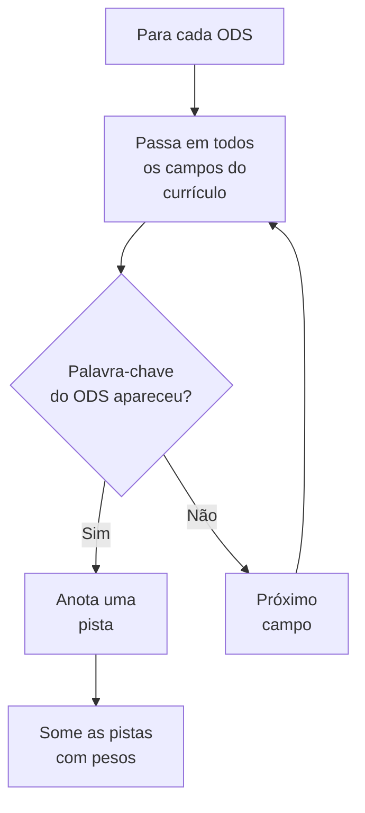
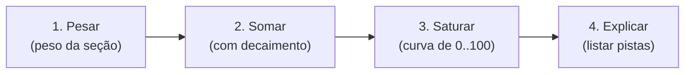
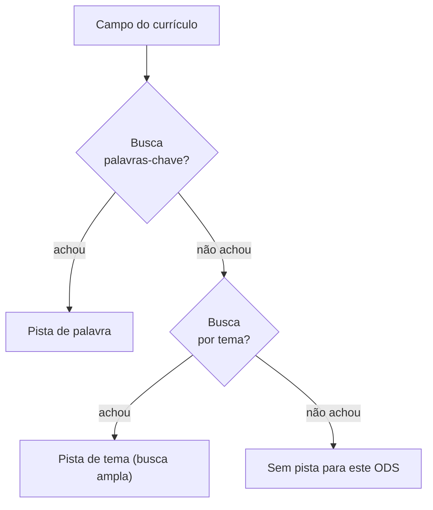

# 04 · O Algoritmo de Classificação

> Como o sistema chega na nota de 0 a 100 para cada ODS — sem magia, sem IA adivinhando.

Este é o coração do sistema. Ele responde à pergunta: *"por que o ODS 13 tem 75 e não 90?"*

Se você quer entender o **que** o sistema guarda, leia [03 — Modelo de Dados](03-modelo-de-dados.md).
Aqui vamos ao **como** ele pontua.

---

## 1. A ideia central: "caçar pistas"

O algoritmo funciona como um detetive que passa uma lista de ODS na mão de cada
documento, procurando **pistas**. Uma pista é quando **uma palavra de um ODS aparece num
campo do currículo**.



> **Analogia:** é como passar um ímã em cima de um monte de areia. As pistas são os
> preguinhos que o ímã (o ODS) consegue puxar. Quanto mais preguinhos, maior a nota.

---

## 2. Os quatro passos da nota

O cálculo da nota é feito em **quatro etapas**, sempre na mesma ordem:



### Passo 1 — Pesar
Cada pista ganha o **peso da seção** onde apareceu. Uma publicação sobre clima vale mais
que uma menção solta:

| Onde a pista apareceu | Peso |
|-----------------------|------|
| Linha de pesquisa / título de publicação | 1.0 |
| Título de projeto | 0.8 |
| Resumo / descrição | 0.7 |
| Formação | 0.4 |
| Menção genérica | 0.3 |

### Passo 2 — Somar (com decaimento)
Se a mesma pista aparece várias vezes, a **1ª** conta 100%, a **2ª** conta 70%, a **3ª**
50% etc. Isso evita que um ODS ganhe nota alta só porque a palavra se repetiu.

> **Por que isso importa?** Um currículo que repete "clima" 50 vezes não deveria
> automaticamente bater um que fala de clima 500 vezes. A soma "decai", ficando mais
> lenta a cada ocorrência — como um copo que enche rápido no começo e devagar no fim.

### Passo 3 — Saturar (a curva)
A soma bruta é convertida em nota de 0 a 100 por uma **curva exponencial**:

```
nota = 100 × (1 − e^(−soma ÷ K))
```

onde **K** é um número que controla a "velocidade" da curva (no código, K = 1,4).

```mermaid
xyChart
    title "Soma bruta → Nota (0 a 100)"
    xaxis "Soma bruta" [0, 2, 4, 6, 8, 10]
    yaxis "Nota" [0, 25, 50, 75, 100]
    line [0, 17, 33, 46, 56, 64]
    line [0, 33, 51, 65, 75, 82]
```

> **Ler o gráfico:** notas sobem rápido no começo e desaceleram no fim. Isso significa
> que **poucas pistas já dão uma nota razoável**, mas chegar perto de 100 exige
> **muitas pistas** — e não vale a pena repetir palavras infinitamente.

### Passo 4 — Explicar
O sistema lista as **pistas** que formaram a nota (limitado a 6 por ODS). Assim, a nota
nunca é um número misterioso — ela sempre tem **evidências** que a justificam.

---

## 3. O que conta como "pista"

Um ODS tem **duas formas** de achar pistas:

| Tipo | Como funciona | Quando |
|------|---------------|--------|
| **Palavras‑chave** | Busca direta de palavras (ex.: "metano") | Sempre |
| **Temas** | Busca ampla por sinônimo (ex.: "clima") | Só se nenhuma palavra‑chave bater |



> **Por que duas formas?** As palavras‑chave são precisas; os temas são amplos. Um ODS
> pode não ter a palavra exata, mas ter o **conceito**. A busca ampla captura isso sem
> confundir com a busca direta.

---

## 4. Exemplo prático: ODS 13 em um currículo

Considere um currículo com:

- **Linha de pesquisa:** *"Mudanças Climáticas e Ecossistemas"*
- **Publicação:** *"Aquecimento Global e Biodiversidade Florestal"*
- **Palavras‑chave:** *"mudanças climáticas"*

Para o **ODS 13 (Ação Climática)**, o Scorer encontra:

| Pista | Seção | Peso |
|-------|-------|------|
| clima | linha de pesquisa | 1.0 |
| clima | publicação | 1.0 |
| clima | palavra‑chave | 0.7 |

Soma bruta ≈ 1,0 + 1,0×0,7 + 0,7×0,7² ≈ **2,35**

Aplicando a curva: `100 × (1 − e^(−2,35/1,4))` ≈ **64** (nota)

> O resultado final mostra: *"ODS 13: 64 — pistas encontradas: clima (linha, publicação, palavra‑chave)"*.

---

## 5. O que o algoritmo NÃO faz (e por quê)

| O que NÃO faz | Por quê |
|---------------|---------|
| **Usar IA generativa** | Daria respostas inconsistentes; o Lattes exige determinismo |
| **Adivinhar o contexto** | "água" pode ser ODS 6 ou 14; ele não "sabe", ele "pega pistas" |
| **Normalizar entre currículos** | Não compara dois currículos; cada um é analisado sozinho |

> **Isso é de propósito:** para análise acadêmica, é melhor **verificável** do que
> "inteligente". Um avaliador precisa poder **reproduzir** a nota, passo a passo.

---

## 6. Resumo

O algoritmo é uma linha de montagem:

1. **Cace pistas** (palavras‑chave e temas)
2. **Pese** cada pista pelo peso da seção
3. **Some** com decaimento (repetição vale menos)
4. **Sature** numa curva de 0 a 100
5. **Explique** listando as pistas

Mesma entrada → mesma saída, sempre. E cada nota vem com suas pistas — nenhuma é mágica.
