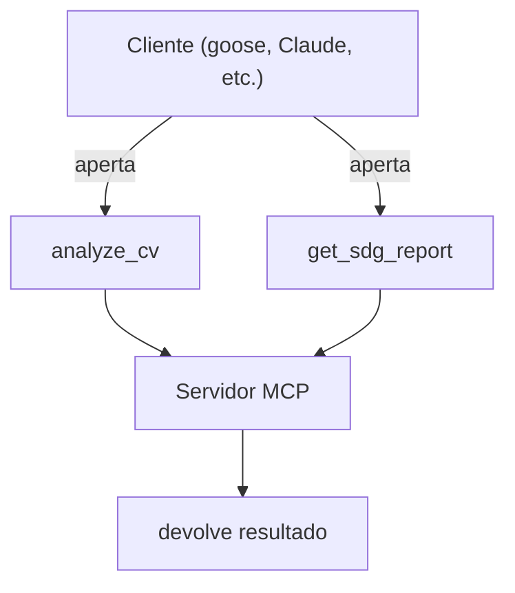
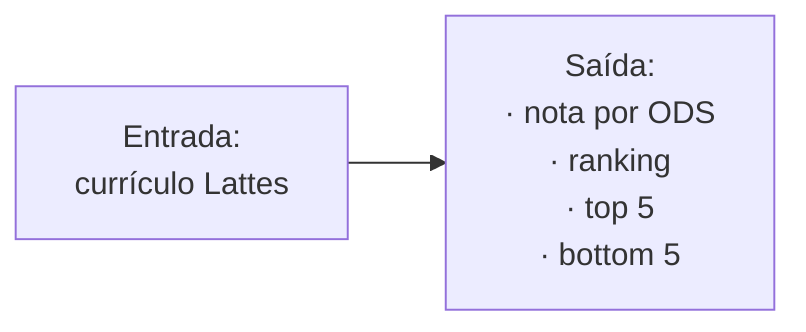
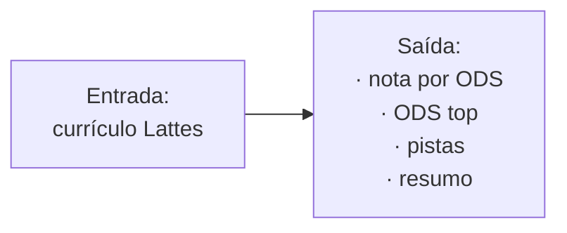
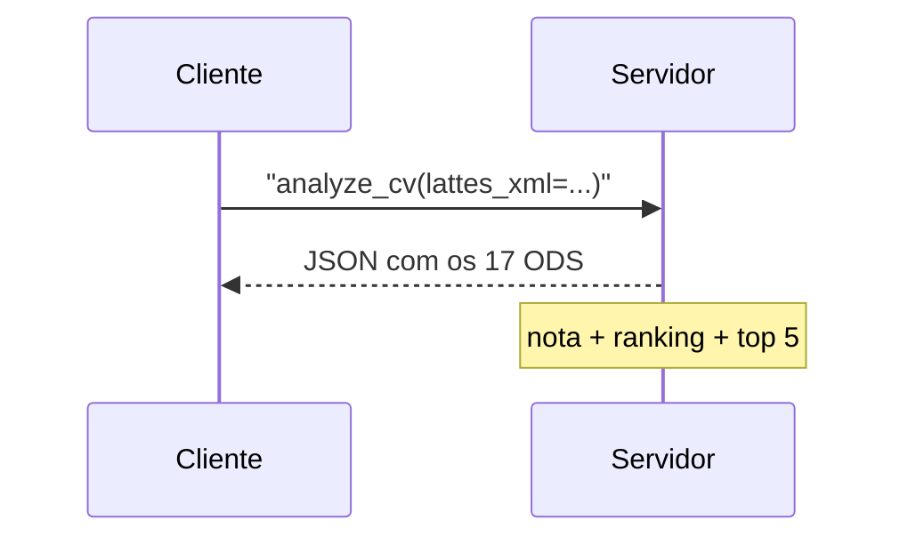
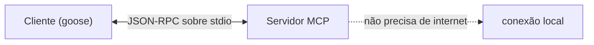

# 05 · A Interface (Ferramentas)

> Como um programa "conversa" com o servidor.

O servidor **não tem tela, menu ou botão**. Ele só responde quando alguém **chama uma
ferramenta**. Essa é a "boca" do sistema — o único lugar onde ele se comunica com o mundo.

Se você quer entender o que o sistema faz por dentro, leia [02 — Arquitetura](02-arquitetura.md).
Aqui vamos ao **como usar**.

---

## 1. O que é uma "ferramenta"

Pense em uma **ferramenta** como um **botão que outro programa pode apertar**. O servidor
expose **duas ferramentas** para o cliente (goose, Claude, etc.):



> **Analogia:** o servidor é uma máquina de café silenciosa. Ela não fala nada sozinha —
> só faz algo quando você **aperta um botão** (chama uma ferramenta).

---

## 2. As duas ferramentas

| Ferramenta | O que pede | O que devolve |
|------------|-----------|---------------|
| **analyze_cv** | *"Analise este currículo"* | Nota de todos os 17 ODS, ranking e top 5 |
| **get_sdg_report** | *"Me dê o relatório completo"* | Scores, ODS top, pistas de cada um |

### Ferramenta 1 — `analyze_cv` (a mais rápida)

Usa quando quer **a resposta curta**: *"quais ODS este currículo mais atende?"*



### Ferramenta 2 — `get_sdg_report` (a mais completa)

Usa quando quer **saber por quê**: *"quais pistas formaram cada nota?"*



---

## 3. Como enviar o currículo

Cada ferramenta aceita o currículo de **duas formas**:

| Formato | Como funciona | Quando usar |
|---------|---------------|-------------|
| **XML colado** | O XML vem "dentro" da chamada | Demonstração, teste rápido |
| **Caminho de arquivo** | Um caminho para o `.xml` no disco | Uso real, com o Lattes salvo |

```mermaid
flowchart TB
    C["Cliente"]
    C -->|colar| XML["lattes_xml = '<XML aqui>'"]
    C -->|arquivo| F["file_path = 'C:\\...\\cv.xml'"]
    XML --> S["Servidor"]
    F --> S
    S --> "decodifica e analisa"
```

> **Por que as duas formas?** Colar é prático para mostrar; arquivo é prático para usar.
> O servidor entende **as duas** e faz a mesma análise.

---

## 4. Exemplo de chamada e resposta

Assuma que o cliente chama a ferramenta `analyze_cv` assim:



E o servidor devolve algo assim (resumido):

```json
{
  "scores": [
    { "sdg_id": 13, "title": "Ação Climática", "score": 64.2,
      "matched_keywords": ["clima"], "evidence": [
        { "keyword": "clima", "section": "linhaPesquisa", "text": "Mudanças Climáticas..." }
      ]
    }
  ],
  "top_sdg": [ { "sdg_id": 13, "title": "Ação Climática", "score": 64.2 } ],
  "summary": { "analyzed_sdg": 5, "max_score": 64.2 }
}
```

> ⚠️ **Detalhe:** a resposta é **JSON** — um formato que o cliente (a IA) sabe ler. O
> humano vê o resultado no [06 — Runtime](06-runtime.md) via `demo.py` ou `test`.

---

## 5. A "porta de comunicação" (stdio)

O servidor fala com o cliente por meio de uma **conexão local** chamada **stdio**. Não
precisa de internet nem de servidor web — é como dois programas conversando pelo
mesmo cabo.



> **Por que stdio?** É o padrão dos servidores locais (como este). É rápido, simples e
> não expõe nada na rede.

---

## 6. Resumo

O servidor tem **uma boca** (as ferramentas) e **duas formas de receber o currículo**
(colar ou arquivo). Chama uma ferramenta, entrega o currículo, recebe a nota. Nada mais
precisa o humano saber para **usar** — mas, se quiser entender o motor, vá para
[04 — Algoritmo](04-algoritmo.md).
