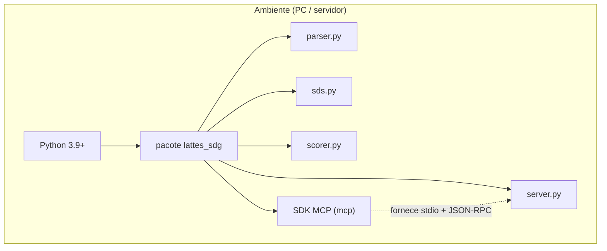
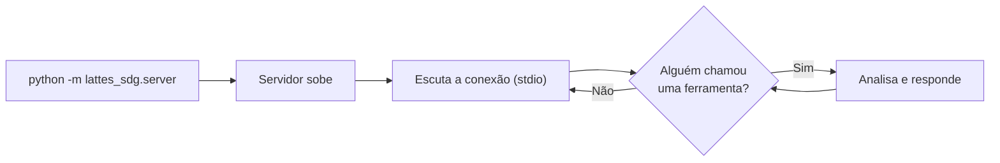
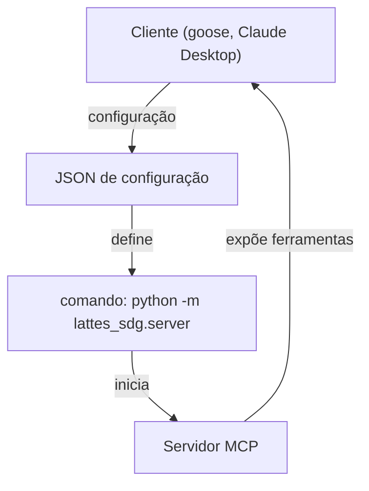
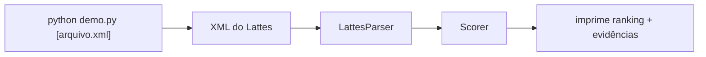

# 06 · Runtime e Implantação

> Como o sistema é **rodado** e **instalado** na prática.

Este documento explica como o servidor vive, onde é executado e como alguém o coloca
para funcionar. Se você quer saber como ele **funciona** por dentro, leia
[02 — Arquitetura](02-arquitetura.md).

---

## 1. Onde o sistema vive

O sistema é um **pacote Python** chamado `lattes_sdg`. Ele roda dentro do **Python** (a
versão 3.9+ funciona). Não precisa de banco de dados, de servidor web nem de internet.



> **Lembrete:** o SDK do MCP (`mcp`) é a única dependência. Ele já vem instalado no
> ambiente — não precisa instalar nada à mais.

---

## 2. Como rodar o servidor

O servidor é iniciado como um **processo Python** que fala por `stdio`:

```bash
python -m lattes_sdg.server
```

Isso "liga" o servidor e o deixa esperando que o cliente (goose, Claude, etc.) lhe
envie uma ordem. Ele **não faz nada** até alguém chamar uma ferramenta.



> **Curiosidade:** o servidor pode rodar em **qualquer** lugar que tenha Python.
> Não há "servidor rodando para sempre" — ele sobe, espera, responde, e pode ser
> reiniciado quantas vezes quiser.

---

## 3. Como um cliente se conecta

Para que o servidor seja usado, um **cliente de IA** precisa saber como "achá-lo". Isso
é feito por uma **configuração simples** que diz: *"quando o usuário quiser, rode este
comando."*



Exemplo de configuração (o cliente lê e sabe como iniciar o servidor):

```json
{
  "mcpServers": {
    "lattes-sdg": {
      "command": "python",
      "args": ["-m", "lattes_sdg.server"]
    }
  }
}
```

> **Analogia:** é como cadastrar o número de um serviço de emergência. O cliente guarda
> o "comando de acionar" e, na hora H, só precisa usá-lo.

---

## 4. Como testar sem cliente

Se você só quer **ver o sistema funcionando** (sem precisar de um cliente de IA), use o
`demo.py`, que roda a análise por conta própria:

```bash
python demo.py
python demo.py caminho/para/curriculo.xml
```

Sem argumento ele usa o XML da raiz do projeto (não versionado); com argumento, roda em
qualquer currículo — inclusive nos fixtures de `tests/fixtures/`. A saída traz a fonte, os
campos, as seções, o ranking dos ODS com nota acima de zero e uma evidência por ODS. É a
forma mais rápida de ver o sistema em ação.



E os **testes automáticos** garantem que nada quebra:

```bash
python -m pytest -q
```

---

## 5. O que é preciso para rodar

| Item | Necessário | Observação |
|------|-----------|------------|
| **Python** | 3.9 ou superior | Testado no 3.14 |
| **SDK MCP** | já instalado | Não precisa instalar |
| **Arquivo Lattes** | `.xml` oficial | Ou um caminho de arquivo |
| **Internet** | não | Tudo roda localmente |

> **Resumo:** é só ter Python instalado. Nada de servidor, banco de dados ou nuvem.

---

## 6. Resumo

O servidor é **um comando Python simples** (`python -m lattes_sdg.server`) que vive
dentro do Python, fala por `stdio` e só precisa de um cliente para ser usado. Para ver o
resultado sem cliente, use `demo.py`.

- **Rodar:** `python -m lattes_sdg.server`
- **Ver funcionando:** `python demo.py [arquivo.xml]`
- **Testar:** `python -m pytest -q`
