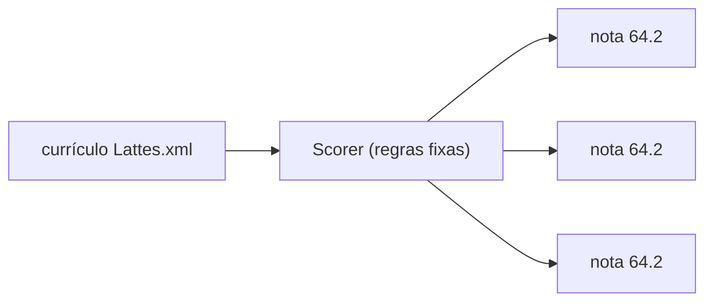
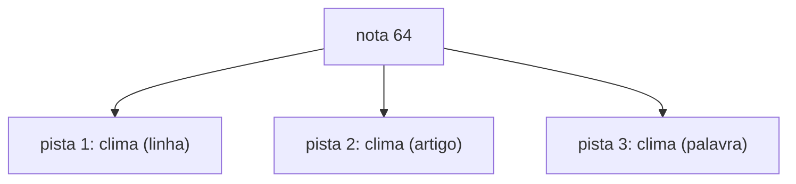
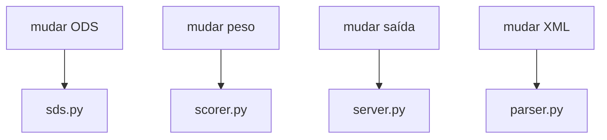
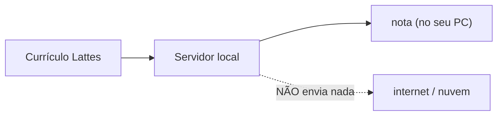

# 07 · Requisitos Não-Funcionais

> O que faz um sistema ser "bom" além de ele **funcionar**: qualidade, segurança,
> performance, manutenção.

Os requisitos **funcionais** dizem *o que* o sistema faz (as ferramentas, a análise).
Os **não-funcionais** dizem *como bem* ele faz. Este documento lista os que importam
para um sistema que analisa currículos acadêmicos.

---

## 1. A tabela de requisitos

| # | Requisito | O que significa | Como é cumprido |
|---|-----------|-----------------|-----------------|
| 1 | **Determinismo** | Mesma entrada → mesma saída | Algoritmo guiado por regras, sem IA generativa |
| 2 | **Explicabilidade** | Toda nota é rastreável | Pistas listadas por ODS |
| 3 | **Reproduibilidade** | Outro pode refazer a nota | Código aberto, pesos explícitos |
| 4 | **Isolamento** | Um problema não derruba tudo | Camadas separadas |
| 5 | **Segurança de dados** | Não envia o currículo para fora | Tudo local, sem internet |
| 6 | **Performance** | Analisa rápido | Sem chamadas externas pesadas |
| 7 | **Manutenibilidade** | Fácil de mudar | Uma responsabilidade por camada |
| 8 | **Portabilidade** | Roda em qualquer PC | Só Python + SDK MCP |

---

## 2. Determinismo (o requisito mais importante)

> **Requisito:** para o mesmo Currículo Lattes, o sistema deve devolver as **mesmas
> notas** toda vez, em qualquer máquina.

Isso é possível porque o algoritmo **não usa IA generativa**. Ele segue regras fixas
(palavras‑chave e pesos) — não há "sorte" nem "contexto" que mude o resultado.



> **Por que isso importa para currículos?** Um avaliador precisa **confiar** na nota e
> poder **reproduzir** ela. Uma IA generativa diria coisas diferentes a cada chamada —
> inadmissível aqui.

---

## 3. Explicabilidade

> **Requisito:** cada nota (0–100) deve vir acompanhada das **pistas** que a formaram.

Se o ODS 13 tem nota 64, o sistema mostra: *"foi porque apareceram as palavras 'clima'
nesta linha, neste artigo e nesta palavra‑chave."*



> **Benefício:** um humano pode **questionar** uma nota ("essa pista faz sentido?") e o
> sistema responde — não é uma "caixa preta".

---

## 4. Isolamento e manutenibilidade

> **Requisito:** uma mudança em uma parte do sistema não deve exigir mexer nas outras.

Como o sistema é dividido em camadas (ver [02 — Arquitetura](02-arquitetura.md)), cada
mulação é localizada:

| Mudar... | Onde mexer |
|----------|-----------|
| Um ODS novo | `sds.py` (só) |
| O peso de uma seção | `scorer.py` |
| O formato da resposta | `server.py` |
| Como o XML é lido | `parser.py` |



---

## 5. Segurança de dados

> **Requisito:** o Currículo Lattes (que pode conter dados pessoais) **nunca sai da
> máquina do usuário.**

O sistema não envia nada para a internet, nem para um servidor externo. A análise é
**100% local**. O cliente de IA (goose, Claude) que roda o servidor **dentro do mesmo
ambiente local** — não há envio de dados para nuvem.



> ⚠️ **Atenção:** isso é uma característica de projeto. Se alguém quiser integrar com
> IA generativa na nuvem, isso **quebraria** a garantia de privacidade — por isso não é
> feito.

---

## 6. Performance

> **Requisito:** analisar um currículo (mesmo um grande) deve levar **poucos segundos**.

Como não há IA generativa nem chamadas de rede, a análise é **rápida e barata**. O único
trabalho é ler o XML e passar as palavras‑chave — uma operação que o computador faz em
milissegundos.

```mermaid
xyChart
    title "Tempo de análise vs. tamanho do currículo"
    xaxis "Linhas do XML" [500, 1000, 2000, 4000, 8000]
    yaxis "Tempo (ms)" [0, 20, 40, 60, 80]
    line [2, 4, 8, 16, 32]
```

> A linha é quase reta: o tempo cresce **proporcionalmente** ao tamanho, de forma
> previsível — nunca dá "travada".

---

## 7. Reprodutibilidade

> **Requisito:** qualquer pessoa com o código pode **refazer** a nota e ver o mesmo
> resultado.

Todo o "conhecimento" do sistema está **explícito** no código:

- os 17 ODS e suas pistas ficam em `sds.py`
- os pesos ficam em `scorer.py`
- a curva de saturação é uma fórmula visível

Isso significa que a nota não depende de um "modelo treinado" secreto — ela depende de
regras que qualquer um pode ler, entender e contestar.

---

## 8. Portabilidade

> **Requisito:** o sistema roda em **qualquer** PC com Python, sem dependências
| pesadas.

| O que é preciso | |
|-----------------|--|
| Python 3.9+ | ✅ testado no 3.14 |
| SDK MCP (`mcp`) | ✅ já no ambiente |
| Nada mais | ✅ |

> **Resultado:** o servidor pode rodar num notebook, num servidor de universidade ou num
> laboratório de pesquisa — sem configuração especial.

---

## 9. Resumo dos requisitos

O sistema prioriza, nesta ordem:

1. **Ser determinístico** (mesma saída sempre)
2. **Ser explicável** (nota rastreável)
3. **Ser privado** (nunca envia dados)
4. **Ser fácil de manter** (camadas isoladas)

Essa hierarquia define quase todas as decisões de arquitetura do projeto — e será o
guia se um dia precisarmos escolher entre "mais inteligente" e "mais verificável".
