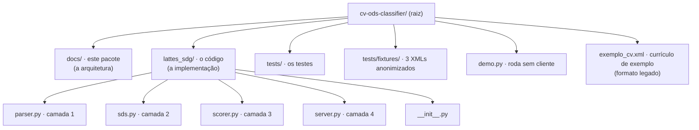
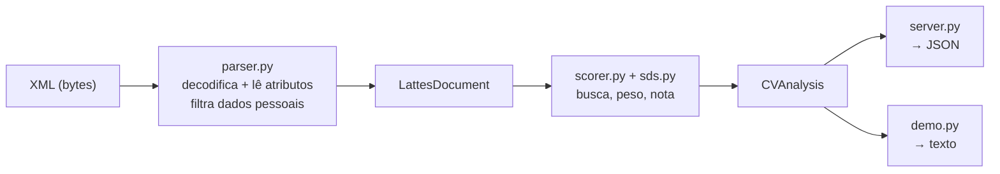
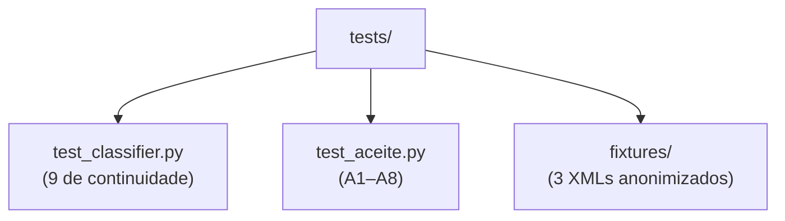

# 10 · Estrutura do Projeto (o código)

> Onde cada coisa vive no repositório — para quem vai mexer na implementação.

Este documento é a **planta** do código. Não é sobre o "conceito" (isso está em
[01 — Conceito](01-conceito.md)) nem sobre o "como funciona" (isso está em
[04 — Algoritmo](04-algoritmo.md)). É o mapa de **onde** cada arquivo está — com a
tabela final de módulos, a API de entrada e saída, os riscos conhecidos e as decisões
tomadas.

---

## 1. A árvore do projeto



> **CV pessoal:** o XML que o `demo.py` usa por padrão fica **na raiz e fora do Git**
> (`.gitignore`). Nenhum dado pessoal de currículo é versionado — a base de teste é
> `tests/fixtures/`, toda anonimizada (regra de ouro da Onda M0).

---

## 2. Os dois mundos

O projeto tem **duas partes distintas**:

| Parte | Onde fica | Para quem |
|-------|-----------|-----------|
| **A arquitetura** | `docs/` | Você agora (leitura) |
| **A implementação** | `lattes_sdg/` | Quem vai codar |

> **Lembrete:** a implementação (`lattes_sdg/`) é o **rascunho de referência**. O
> entregável de arquitetura são os documentos em `docs/`.

---

## 3. Tabela final de módulos

| Módulo | Camada | Responsabilidade | Contrato |
|--------|--------|------------------|----------|
| `lattes_sdg/parser.py` | 1 · leitura | Decodifica o XML (ISO-8859-1 com fallback UTF-8), varre **tags e atributos**, mapeia por tabela explícita + rede de segurança, descarta dados pessoais e anota a origem de cada campo | `parse_lattes_xml(bytes) → LattesDocument` |
| `lattes_sdg/sds.py` | 2 · conhecimento | Os 17 ODS com palavras-chave, temas e exceções; funil único de comparação (normalização, fronteira de palavra, ban-list) | `build_taxonomy() → SDGTaxonomy` |
| `lattes_sdg/scorer.py` | 3 · cálculo | Peso de seção, decaimento, saturação, dedupe de evidências e fallback por temas | `Scorer.analyze(doc) → CVAnalysis` |
| `lattes_sdg/server.py` | 4 · exposição | Ferramentas MCP `analyze_cv` e `get_sdg_report`, JSON sobre stdio | JSON-RPC 2.0 / stdio |
| `demo.py` | — · CLI | Classifica um XML e imprime fonte, campos, seções, ranking e evidências | `python demo.py [arquivo.xml]` |
| `tests/test_classifier.py` | — · regressão | Os 9 testes de continuidade | pytest |
| `tests/test_aceite.py` | — · aceite | Os critérios A1–A8 da Onda M0 | pytest |
| `tests/fixtures/*.xml` | — · dados | 3 currículos no formato oficial, anonimizados | nenhum dado pessoal |
| `docs/` | — · arquitetura | O entregável de arquitetura (01–12) | Markdown |

---

## 4. API de entrada e saída

### 4.1 Biblioteca Python

| Função / classe | Entrada | Saída |
|-----------------|---------|-------|
| `parse_lattes_xml(xml_bytes)` | `bytes` ou `str` do XML (oficial ISO-8859-1/UTF-8, ou legado) | `LattesDocument` |
| `parse_lattes_file(path)` | caminho de um `.xml` | `LattesDocument` |
| `LattesDocument.fields` | — | lista de `Field{section, text, weight, tag_origem}` |
| `LattesDocument.as_text()` / `by_section(s)` / `sections()` | seção (quando aplicável) | texto concatenado / textos da seção / mapa seção → textos |
| `build_taxonomy()` | — | `SDGTaxonomy` com os 17 `SDG` |
| `SDG.matches(texto)` | texto de um campo | pistas (keywords + temas) que casam — normalizadas, palavra inteira |
| `SDG.matches_temas(texto)` | texto completo do currículo | só os temas (usado no fallback) |
| `Scorer(taxonomy).analyze(doc)` | `LattesDocument` | `CVAnalysis` |
| `CVAnalysis.ranking` / `top(n)` / `bottom(n)` / `get(id)` | — | `SDGScore` ordenado por nota |
| `SDGScore` | — | `sdg_id`, `title`, `score` (0–100), `matched_keywords[]`, `evidence[]` |
| `evidence[i]` | — | `{keyword, section, text, tag_origem}` — no máximo 1 por campo por ODS e 6 por ODS |

### 4.2 Servidor MCP (JSON sobre stdio)

| Ferramenta | Entrada | Saída (JSON) |
|------------|---------|--------------|
| `analyze_cv` | `lattes_xml` (XML cru ou base64) **ou** `file_path` | `scores[]`, `top_sdg[]`, `bottom_sdg[]`, `summary` |
| `get_sdg_report` | idem | `scores[]`, `ranking[]`, `top_sdg[]`, `summary` |

Cada item de `scores`/`ranking` é
`{sdg_id, title, score, matched_keywords, evidence}` — o mesmo shape da biblioteca.

### 4.3 CLI (demo)

```
python demo.py [caminho/para/curriculo.xml]
```

Sem argumento, o caminho padrão é o XML da raiz (não versionado). A saída vem, nesta
ordem: **fonte** → **campos extraídos** → **seções com contagem** → **ranking dos ODS
com nota acima de zero** → **uma evidência por ODS**, com `section`, `tag_origem` e o
trecho citado.

---

## 5. O fluxo do dado (do arquivo à nota)



> **Ler o fluxo:** o bytes vira campo no `parser.py` (sem dados pessoais), vira nota no
> `scorer.py` (consultando a taxonomia do `sds.py`), e daí sai por dois caminhos — JSON no
> `server.py` ou texto no `demo.py`. Cada seta é uma camada diferente, e os contratos
> entre elas (`LattesDocument`, `CVAnalysis`) **não mudaram** na Onda M0.

---

## 6. Como cada camada é testada

`python -m pytest -q` → **19 testes verdes** (9 de continuidade + 10 de aceite).



| Grupo | Arquivo | O que verifica |
|-------|---------|----------------|
| Continuidade (9) | `tests/test_classifier.py` | os 17 ODS, notas entre 0 e 100, ranking, clima no topo, floresta presente, saúde média, água zerada sem pistas, evidências explicadas, currículo vazio → zero |
| A1–A2 | `tests/test_aceite.py` | CV real expurgado → ≥ 30 campos em ≥ 5 seções; ≥ 3 ODS com nota > 20 e topo coerente |
| A3 | idem | CV mínimo (só nome + área) → **17 notas zero** |
| A4 | idem | título com "climaticas" → ODS 13 em `pub_titulo`, peso 1,0 |
| A5 | idem | nenhuma combinação campo/ODS gera evidência duplicada |
| A6 | idem | duas execuções → JSON idêntico byte a byte (inclusive com `PYTHONHASHSEED` diferente) |
| A7 | idem | os 9 testes de continuidade apontam para o fixture em formato oficial |
| A8 | idem | varredura dos campos extraídos: **zero** CPF, e-mail ou telefone |

> **Regra de ouro:** nenhum teste depende de dados pessoais — só dos fixtures anônimos
> de `tests/fixtures/`.

---

## 7. Riscos conhecidos

| Risco | Impacto | Como mitigamos |
|-------|---------|----------------|
| Tabela de mapeamento incompleta (variantes do export do Lattes) | campos perdidos, notas baixas demais | rede de segurança por padrão de nome (peso 0,5) + a tabela cresce sem mudar a arquitetura |
| Superajuste ao único CV real disponível | falsa sensação de pronto | fixture sintético no formato oficial + testes por seção, não por CV |
| Acentuação ISO-8859-1 × UTF-8 | texto corrompido, pistas perdidas | decodificação por validação estrita com fallback; a suíte cobre os dois encodings |
| Atributos `*-INGLES` duplicando pistas | nota inflada pela mesma peça traduzida | o campo traduzido entra com metade do peso |
| Fixture mal anonimizado | vazamento de dados pessoais no Git | checklist de expurgo + teste A8 varra os campos; o CV da raiz fica fora do Git |
| `demo.py` sem argumento depende do XML da raiz (não versionado) | demo falha em clone limpo | `python demo.py <caminho>` aceita qualquer XML; os fixtures em `tests/fixtures/` sempre estão presentes |
| Pesos, decaimento e K dos docs 03/04 ainda não batem com o código | leitor confia em número desatualizado | reconciliação reservada à Onda M1; os docs apontam `scorer.py` como fonte da verdade |
| Rede de segurança aceitar atributo de seção errada | pista com seção/peso inadequado | peso conservador 0,5 e a tabela explícita tem precedência sobre o padrão |

---

## 8. Decisões tomadas (Onda M0)

| # | Decisão | Por quê (alternativa rejeitada) |
|---|---------|--------------------------------|
| D1 | Decodificar com validação estrita de UTF-8; caso contrário, ISO-8859-1 | a declaração `encoding` do export é inconsistente; `errors="replace"` corromperia pistas em silêncio |
| D2 | Tabela explícita `elemento → atributo → seção → peso` **mais** rede de segurança por padrão de nome (peso 0,5) | só a rede não distingue seção nem peso; só a tabela quebra com variação entre versões |
| D3 | Denylist de dados pessoais **antes** de qualquer mapeamento | a negação tem precedência — senão `NOME-DA-MAE` casaria com o padrão `NOME-DA-*` |
| D4 | `Field.tag_origem` (campo aditivo) | rastreabilidade até a tag do XML sem mudar `parse_lattes_xml() → LattesDocument` |
| D5 | Funil único de busca: normalização + fronteira de palavra + ban-list com exceções | mata os falsos positivos por substring ("ia" em "Ciências", "mar" em "Maria") mantendo `CO2` autorizado |
| D6 | Fallback por temas: uma vez por ODS, só sem correspondência, no máximo 1 evidência | cumpre o doc 04 sem inflar a lista de evidências |
| D7 | No máximo 1 evidência por campo por ODS, com as palavras agrupadas | um mesmo campo não prova duas vezes o mesmo ODS |
| D8 | Determinismo byte a byte (listas ordenadas, sem iteração de `set` no caminho da saída) | o Lattes exige resultado reproduzível e auditável (critério A6) |
| D9 | Traduções `-INGLES` recebem metade do peso | não inflar a nota pela mesma peça duas vezes |
| D10 | Fixtures anônimos como única base de teste | nenhum teste pode depender de dados pessoais |
| D11 | Contrato público preservado (parser → `LattesDocument`; ferramentas MCP inalteradas) | Scorer e servidor não precisam saber que o leitor por baixo mudou |

---

## 9. Resumo

- **A arquitetura** está em `docs/` (leia este pacote primeiro).
- **A implementação** está em `lattes_sdg/` (quatro arquivos, quatro camadas).
- **Os testes** estão em `tests/` — 19 verdes, contra fixtures anonimizados.
- **O demo** roda com `python demo.py [arquivo.xml]`.

Onde mexer, se precisar mudar algo:

| Mudar... | Vá em... |
|----------|----------|
| Um ODS novo ou uma pista | `lattes_sdg/sds.py` |
| Um atributo do XML que precisa virar campo | `lattes_sdg/parser.py` → `TABELA_ATRIBUTOS` |
| O peso de uma seção, o decaimento ou a curva | `lattes_sdg/scorer.py` → `SECTION_WEIGHTS`, `DECAY`, `SATURATION_K` |
| A saída (JSON) | `lattes_sdg/server.py` |
| O que a demo imprime | `demo.py` |
