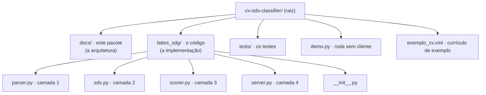
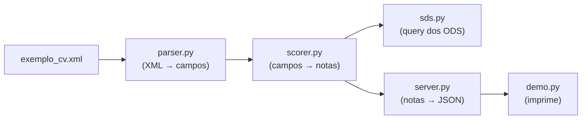
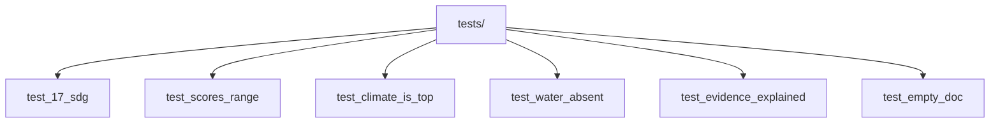

# 10 · Estrutura do Projeto (o código)

> Onde cada coisa vive no repositório — para quem vai mexer na implementação.

Este documento é a **planta** do código. Não é sobre o "conceito" (isso está em
[01 — Conceito](01-conceito.md)) nem sobre o "como funciona" (isso está em
[04 — Algoritmo](04-algoritmo.md)). É o mapa de **onde** cada arquivo está.

---

## 1. A árvore do projeto

---

## 2. Os dois mundos

O projeto tem **duas partes distintas**:

| Parte | Onde fica | Para quem |
|-------|-----------|-----------|
| **A arquitetura** | `docs/` | Você agora (leitura) |
| **A implementação** | `lattes_sdg/` | Quem vai codar |

> **Lembrete:** a implementação (`lattes_sdg/`) é o **rascunho de referência**. O
> entregável de arquitetura são os documentos em `docs/`.

---

## 3. O que cada arquivo faz

### O pacote `lattes_sdg/` (o coração)

| Arquivo | Camada | O que faz |
|---------|--------|-----------|
| `__init__.py` | — | Marca o pacote como instalável |
| `parser.py` | 1 · LattesParser | Lê o XML e extrai campos categorizados |
| `sds.py` | 2 · SDGTaxonomy | Lista os 17 ODS com pistas |
| `scorer.py` | 3 · Scorer | Calcula a nota de cada ODS |
| `server.py` | 4 · ReportBuilder | Expõe as ferramentas MCP |

### Ferramentas de teste e demonstração

| Arquivo | O que faz |
|---------|-----------|
| `demo.py` | Roda a análise no `exemplo_cv.xml` e imprime o resultado |
| `exemplo_cv.xml` | Um currículo Lattes de exemplo (com pistas de vários ODS) |
| `tests/test_classifier.py` | Testes que garantem que nada quebra |
| `requirements.txt` | As dependências (só o SDK do MCP) |

---

## 4. O fluxo do dado (do arquivo à nota)

> **Ler o fluxo:** o dado nasce no `exemplo_cv.xml`, vira campo no `parser.py`, vira nota
> no `scorer.py` (consultando `sds.py`), vira resposta no `server.py`, e o `demo.py` o
> imprime. Cada seta é uma camada diferente.

---

## 5. Como cada camada é testada

Os testes (`tests/test_classifier.py`) cobrem os pontos que mais importam:

| Teste | O que verifica |
|-------|----------------|
| `test_17_sdg` | O sistema classifica os 17 ODS |
| `test_scores_range` | Todas as notas estão entre 0 e 100 |
| `test_climate_is_top` | ODS 13 (clima) tem nota alta quando há pistas |
| `test_water_absent` | ODS 14 (água) fica zerado sem pistas |
| `test_evidence_explained` | Cada nota vem com pistas rastreáveis |
| `test_empty_doc` | Currículo vazio → nota zero |

---

## 6. Resumo

- **A arquitetura** está em `docs/` (leia este pacote primeiro).
- **A implementação** está em `lattes_sdg/` (quatro arquivos, quatro camadas).
- **O teste** está em `tests/`.
- **O demo** roda com `python demo.py`.

Onde mexer, se precisar mudar algo:

| Mudar... | Vá em... |
|----------|----------|
| Um ODS novo | `lattes_sdg/sds.py` |
| O peso de uma seção | `lattes_sdg/scorer.py` |
| A saída (JSON) | `lattes_sdg/server.py` |
| Como o XML é lido | `lattes_sdg/parser.py` |
