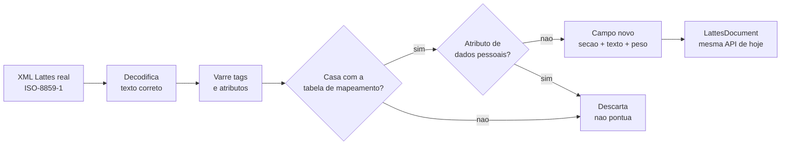
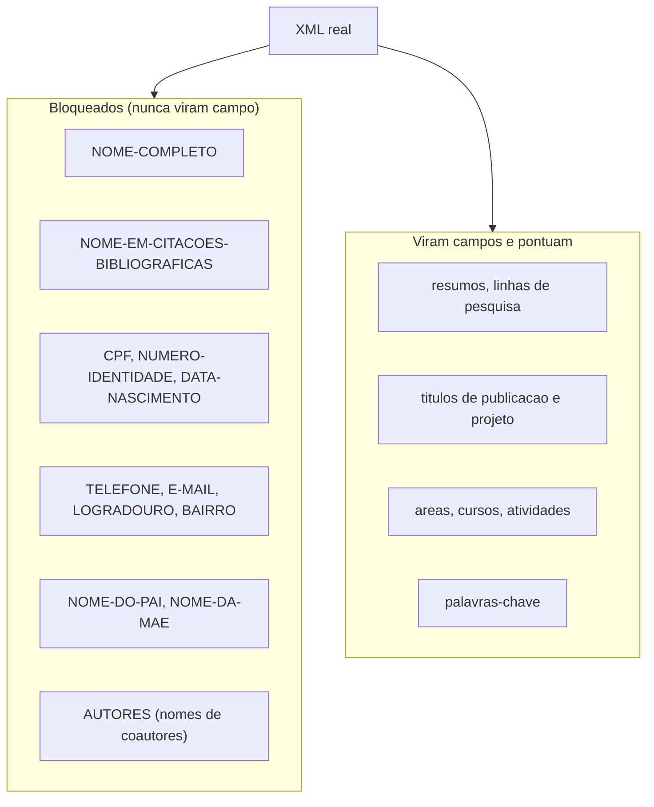
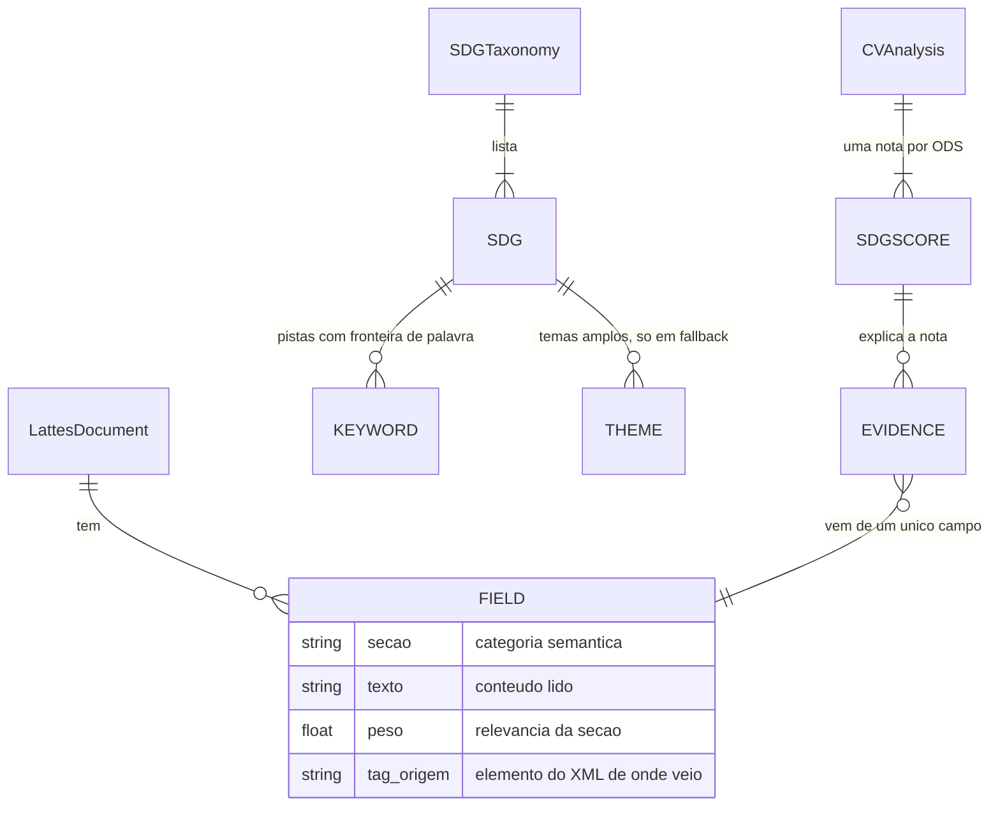
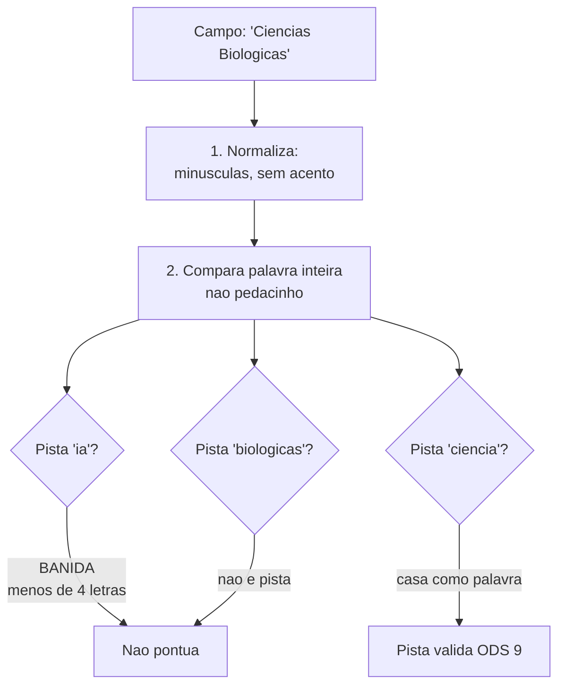
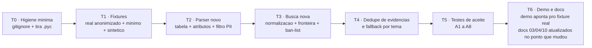

# 12 · Plano da Onda M0 — Ler o mundo real

> Este documento é o **plano de construção** da Onda M0, derivado da auditoria de 25/09/2026.
> Ele responde: *o que exatamente muda, por quê, em que ordem e como sabemos que deu certo?*
>
> **Em uma frase:** fazer o sistema ler o **XML real do Lattes** (que hoje resulta em 0 campos
> extraídos) e matar os falsos positivos que pontuam o **nome** do pesquisador.

---

## 1. A meta, em uma frase

> **"Apontar um CV Lattes de verdade (exportado do sistema oficial) e receber as 17 notas
> com evidências — sem inventar pistas que só existiam no nome ou na área do autor."**

### O que entra nesta onda

| # | Mudança | Motivo (achado da auditoria) |
|---|---------|------------------------------|
| 1 | Parser novo para o XML oficial (dados em **atributos**, tags MAIÚSCULAS, ISO-8859-1) | P0-1: CV real → 0 campos, 17 notas zeradas |
| 2 | Busca com **fronteira de palavra** + normalização de acentos + ban-list | P0-2: "Ciências" pontua ODS 9 (pista "ia"); "Maria" pontua ODS 14 (pista "mar") |
| 3 | Corrigir o mapeamento dos **títulos de publicação** | P1-1: `tituloDoTrabalho` não está no mapa; pesos 1.0 são código morto |
| 4 | **Deduplicar evidências** (1 por campo) | P1-3: um campo com "Climáticas" gerou 4 evidências iguais |
| 5 | **Fixtures reais** (CV expurgado de dados pessoais) como base de teste | P0-1 e P2-privacidade: os 9 testes atuais validam um XML que o projeto inventou |

### O que NÃO entra (de propósito)

| Fora desta onda | Por quê |
|-----------------|---------|
| Reconciliar docs 03/04 com os números reais do código (decaimento, K, pesos) | Onda M1 — não trava a leitura do CV real |
| D9 (origem de cada pista) e D10 (modo ML) | Onda M1 — dependem da taxonomia estabilizada |
| pyproject, LICENSE, CI, mensagens de erro amigáveis do servidor | Onda M2 — higiene, não funcionalidade |
| Comparar currículos entre si | Nunca foi o contrato (ver docs 04 e 07) |

---

## 2. O problema do parser, em linguagem simples

O Lattes que o sistema **aprendeu a ler** guarda as informações como texto solto:

```xml
<tituloDoTrabalho>Aquecimento Global</tituloDoTrabalho>
```

O Lattes **de verdade** guarda as informações **escritas na etiqueta**, não no papel:

```xml
<TRABALHO-EM-EVENTOS>
  <DADOS-BASICOS-DO-TRABALHO TITULO-DO-TRABALHO="AVALIAÇÃO DO IMPACTO DE CURSOS..." .../>
</TRABALHO-EM-EVENTOS>
```

> **Analogia:** é a diferença entre um formulário onde a resposta está escrita na linha
> (fácil de ler) e uma ficha catalográfica onde **tudo está carimbado na margem**
> (nos atributos). O parser atual só sabe ler a linha; o CV real só usa a margem.

Três diferenças de uma vez: (a) dados em atributos, não em texto; (b) tags em MAIÚSCULAS
com hífen (`TRABALHO-EM-EVENTOS`); (c) arquivo em ISO-8859-1 (codificação antiga, que o
parser atual não decodifica corretamente).

---

## 3. O novo parser

### 3.1 Visão do fluxo



O contrato com o resto do sistema **não muda**: `parse_lattes_xml()` continua devolvendo
um `LattesDocument` com campos. O Scorer e o servidor não precisam saber que o leitor
por baixo mudou — essa é a vantagem da divisão em camadas, agora usada a favor da reforma.

### 3.2 A tabela de mapeamento (o coração do parser novo)

O parser passa a ter uma **tabela explícita**: para cada elemento do Lattes real, quais
atributos viram campos de qual seção. Trecho ilustrativo (a tabela completa vive no código):

| Elemento (tag real) | Atributo lido | Vira seção | Peso |
|---------------------|---------------|-----------|------|
| `RESUMO-CV` | `TEXTO-RESUMO-CV-RH` | resumo | 0,8 |
| `LINHA-DE-PESQUISA` | `NOME-DA-LINHA-DE-PESQUISA` | linhaPesquisa | 1,0 |
| `ARTIGO-PUBLICADO` → `DADOS-BASICOS-DO-ARTIGO` | `TITULO-DO-ARTIGO` | pub_titulo | 1,0 |
| `TRABALHO-EM-EVENTOS` → `DADOS-BASICOS-DO-TRABALHO` | `TITULO-DO-TRABALHO` | pub_titulo | 1,0 |
| `TRABALHO-EM-EVENTOS` → `DETALHAMENTO-DO-TRABALHO` | `NOME-DO-EVENTO` | pub_evento | 0,5 |
| `LIVRO-PUBLICADO` → `DADOS-BASICOS-DO-LIVRO` | `TITULO-DO-LIVRO` | pub_obra | 1,0 |
| `PROJETO-DE-PESQUISA` | `NOME-DO-PROJETO` / `DESCRICAO-DO-PROJETO-...` | projeto_titulo / projeto_descricao | 0,8 / 0,9 |
| `AREA-DE-ATUACAO` | `NOME-DA-AREA-DO-CONHECIMENTO` (+ sub-área) | formacao_area | 0,5 |
| `GRADUACAO` / `MESTRADO` / `DOUTORADO` | `NOME-CURSO` + `TITULO-DO-TRABALHO-DE-CONCLUSAO-DE-CURSO` | formacao_area / resumo-like | 0,5 / 0,7 |
| `OUTRA-ATIVIDADE-TECNICO-CIENTIFICA` | `ATIVIDADE-REALIZADA` | atuacao (seção nova) | 0,7 |
| `DIRECAO-E-ADMINISTRACAO` | `CARGO-OU-FUNCAO` | atuacao | 0,4 |
| `PALAVRA-CHAVE` | `PALAVRA-CHAVE-1..6` (quando existir) | palavra_chave | 0,7 |

Duas camadas de tolerância, para o parser não quebrar com variação entre versões:

1. **Tabela explícita** — a via principal, uma linha por par (elemento, atributo).
2. **Rede de segurança por padrão de nome** *(premissa: aceitável para a v1)* — atributos
   não mapeados cujo nome bate com `TITULO-*`, `NOME-DA-*`, `DESCRICAO-*` ou `*PALAVRA-CHAVE*`
   entram com peso conservador (0,5). Tudo o que não casa em nenhuma das duas é **ignorado**.

### 3.3 Privacidade dentro do parser (o filtro de dados pessoais)

O parser novo **descarta no nascedouro** os campos que identificam a pessoa. O currículo
vira, dentro do sistema, só conteúdo acadêmico:



Isso resolve **duas coisas ao mesmo tempo**: a nota deixa de ser movida por nomes
("Maria" → "mar", "Ciências" → "ia") e os dados pessoais nunca entram na saída —
coerência direta com o requisito 5 do doc 07.

### 3.4 Modelo de dados (o que muda no `Field`)

O campo ganha uma anotação de **origem** — de qual elemento ele veio — para evidências
continuarem rastreáveis até o XML original:



Regra nova de evidência: **um campo gera no máximo uma evidência por ODS** — mesmo que
três palavras-chave do mesmo ODS caiam no mesmo campo. As palavras ficam listadas na
própria evidência; a lista deixa de inflar.

---

## 4. A nova busca por pistas

### 4.1 As três correções



1. **Normalização:** texto e pistas passam pelo mesmo funil — minúsculas, sem acento
   ("climática" e "climatica" viram a mesma palavra). Fim do problema de acento.
2. **Fronteira de palavra:** a comparação exige que a pista seja uma **palavra inteira**
   (ou expressão), não um pedaço de outra palavra. "Mar" para de encontrar "Maria".
3. **Ban-list:** pistas com menos de 4 letras não pontuam por padrão ("ia", "mar" como
   substring já morre na regra 2; a ban-list pega o caso de palavra curta solta), com
   **exceções explícitas** na taxonomia (ex.: "CO2" — que vira "co2" na normalização e
   é palavra inteira suficiente).

### 4.2 Fallback por temas (ajuste fino)

O doc 04 promete que a "busca ampla" por temas só acontece **quando nenhuma palavra-chave
bateu no currículo inteiro**. O plano restabelece esse contrato: o fallback roda uma vez
por ODS, depois da varredura principal, e produz **no máximo uma evidência** por ODS.

### 4.3 Antes / depois (o mesmo CV)

Usando o CV real como régua (valores esperados, não comprometidos como exatos):

| Situação | Hoje | Depois da Onda M0 |
|----------|------|-------------------|
| CV real completo | 0 campos · 17 zeros | Dezenas de campos · notas nos ODS de fato presentes |
| CV com só nome + área | ODS 9: 28,3 · ODS 14: 19,3 | 17 zeros |
| Publicação com "Climáticas" no título | Título ignorado | Pontua com peso 1,0 |

---

## 5. Fixtures: a nova base de verdade dos testes

Hoje os testes provam que o sistema entende o XML **que o próprio projeto escreveu**.
A onda troca a régua:

| Fixture | O que é | Uso |
|---------|---------|-----|
| `tests/fixtures/cv_lattes_real_anon.xml` | CV real **expurgado** (nome→anônimo, CPF/telefones/endereços/e-mails removidos, mantidos títulos e seções) | Teste de leitura real + aceites A1–A2, A8 |
| `tests/fixtures/cv_lattes_minimo.xml` | CV mínimo em formato real (só nome+área, sem trabalhos) | Teste anti-falso-positivo (A3) |
| `tests/fixtures/cv_sintetico_formato_real.xml` | O atual `exemplo_cv.xml` reescrito no formato oficial | Continuidade dos 9 testes atuais (A7), demonstração |

> **Regra de ouro:** nenhum teste pode depender de dados pessoais. O CV real só entra no
> repositório anonimizado; o original fica fora do git (ver riscos).

---

## 6. Critérios de aceite (como saberemos que a onda terminou)

Cada critério é um teste automatizado. **A onda só fecha com os 8 verdes.**

| # | Critério | Como se mede |
|---|----------|--------------|
| A1 | O parser lê o CV real expurgado | ≥ 30 campos, de ≥ 5 seções distintas |
| A2 | As notas refletem o conteúdo | ≥ 3 ODS com nota > 20; os ODS do topo correspondem às seções com mais pistas |
| A3 | Falso positivo por nome morre | CV mínimo (só nome/área) → **17 zeros** |
| A4 | Título de publicação pontua | Título com "climaticas" → ODS 13 recebe pista em `pub_titulo` (peso 1,0) |
| A5 | Evidências sem duplicatas | Nenhum ODS tem 2 evidências do mesmo campo |
| A6 | Determinismo preservado | 2 execuções seguidas → JSON idêntico, byte a byte |
| A7 | Os 9 testes atuais sobrevivem | Mesma suíte, apontada para o fixture em formato real, 9/9 |
| A8 | Nenhuma informação pessoal vaza | Varredura dos campos extraídos: zero ocorrências de padrões de CPF, e-mail, telefone |

---

## 7. Ordem de construção



- **T2 antes de T3:** a busca nova só faz sentido testada sobre campos reais.
- **T1 antes de T2:** sem fixture real, o parser novo seria validado contra… o XML inventado
  de novo. O fixture é o quebra-cabeça que prova o parser.
- **T6 é raso de propósito:** apenas sincronizar os pontos dos docs 03, 04 e 10 que a onda
  mudou (seções novas, regra de evidência, fronteira). A reconciliação completa dos números
  (decaimento, K) é da M1.

---

## 8. Premissas

- *(premissa)* O alvo é a **exportação atual do Lattes oficial** (LATTES_OFFLINE, atributos
  MAIÚSCULAS, ISO-8859-1). Se houver outra variante em uso (ex.: XML de integrção antigo),
  a tabela de mapeamento cresce, mas o desenho não muda.
- *(premissa)* O `cv-frederico.xml` da raiz é um **CV real do usuário** e será anonimizado
  antes de virar fixture. Se for sintético, o achado P0-1 muda de gravidade, mas a onda
  continua necessária (o formato oficial é esse).
- *(premissa)* Uma segunda fixture real (de outra pessoa, anonimizada) seria ideal para
  evitar superajuste ao CV de referência; sem ela no curto prazo, a fixture sintética em
  formato real cobre os casos gerais.
- *(premissa)* A rede de segurança por padrão de nome de atributo (seção 3.2) é aceitável
  para a v1, com pesos conservadores, até a tabela explícita cobrir mais variantes.

## 9. Riscos e limites

| Risco | Impacto | Como mitigamos |
|-------|---------|----------------|
| Tabela de mapeamento incompleta (variantes do Lattes) | Campos perdidos, notas baixas demais | Rede de segurança por padrão + 2ª fixture real quando possível |
| Superajuste ao único CV real disponível | Falsa sensação de pronto | Fixture sintética em formato real + testes por seção, não por CV |
| Acentuação ISO-8859-1 × UTF-8 | Texto corrompido, pistas perdidas | Decode declarado + fallback UTF-8; teste com ambos |
| `TITULO-...-INGLES` duplicando pistas | Nota inflada por tradução | O campo original pontua cheio; o em inglês entra com peso reduzido (0,5) |
| Fixture real mal anonimizada | Vazamento de dados pessoais no git | Checklist de expurgo + teste A8 varre os campos, não o arquivo |
| O que fica de fora | Comparação entre currículos, ML, benchmark internacional | Segue fora — o núcleo ainda não existe |

---

## 10. Resumo executivo

A Onda M0 não adiciona nada novo ao produto — ela faz o produto **atender o contrato que
os docs 01–11 já prometem**: ler o currículo oficial e devolver notas explicadas.
Quatro mudanças de engenharia (parser de atributos, busca por palavra inteira, dedupe de
evidências, títulos pontuando) e uma mudança de cultura (testar contra o mundo real,
não contra o XML caseiro). Sem banco, sem rede, sem IA generativa — as três garantias
de projeto continuam de pé.